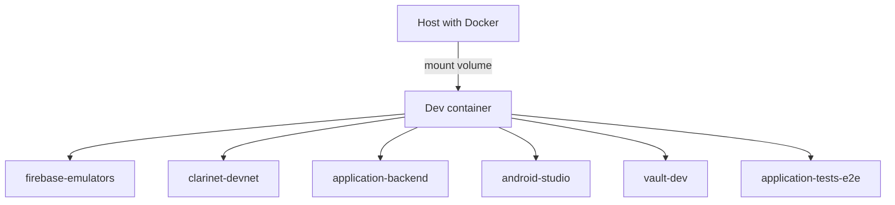
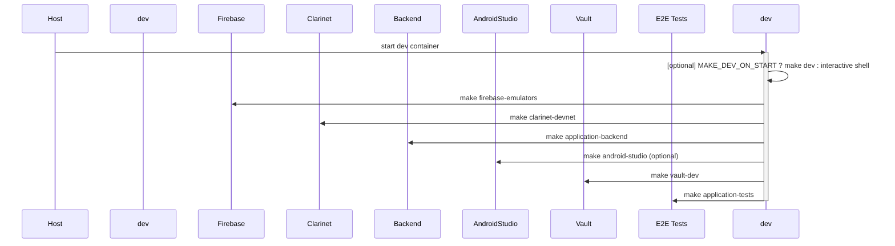

# 🚗 Refactored Winner (aka CAR2GO)

Bienvenue à bord ! Ce projet propose un service de déplacement basé sur des véhicules (backend + mobile/web) piloté par une architecture Google Cloud moderne, sécurisée par Vault, et conçue pour être agréable à développer.

## ✨ Ce que tu trouveras ici

- **Un backend Go** tournant sur Cloud Run
- **Un frontend Flutter** (mobile/web)
- **Des secrets sécurisés avec Vault (GCP Auth)**
- **Une infra déclarée avec Terraform**
- **Un environnement local complet via DevContainer**

---

## ⚙️ Comment démarrer localement

Le conteneur `dev` est la boîte à outils principale du projet. Il embarque tous les outils nécessaires (CLI Docker, make, gcloud, etc.) et partage son système de fichiers avec le host.

Par défaut, ce conteneur exécute automatiquement `make dev` à son démarrage, **sauf si** la variable d’environnement `MAKE_DEV_ON_START=false` est définie (utile en cas de débogage).

Il est également possible de lancer `make dev` directement depuis le host : cela exécutera exactement la même séquence de commandes dans le même environnement, de façon transparente.

Voici une représentation simplifiée de l’architecture locale :



### 🛠️ Détails supplémentaires sur l’environnement local

Le conteneur `dev` est le point d’entrée principal de tout développeur. Il est supposé être lancé automatiquement (via Codespaces ou Devcontainer) et fournir une expérience de développement unifiée. **Il n’est jamais lancé ou détruit par les `Makefile`**.

Une fois dans le conteneur `dev`, tu peux :

- lancer individuellement n’importe quel service avec :
  ```bash
  make firebase-emulators
  make application-backend
  make vault-dev
  make android-studio
  ```
- ou utiliser :
  ```bash
  make dev
  ```
  Ce qui ne fait que chaîner les commandes ci-dessus dans un ordre défini.

> 💡 `make dev` n’a jamais pour effet de recréer ou supprimer le conteneur `dev` lui-même. Il est toujours supposé être lancé **à l’intérieur** du conteneur, pas depuis le host.

And the corresponding sequence diagram:



> ℹ️ Les commandes `make` sont parallélisées avec `-j` pour un démarrage plus rapide.

> 💡 Pré-requis : Docker, Git, un token GCP (`GOOGLE_APPLICATION_CREDENTIALS`), et `make`.

### 1. Cloner le projet

```bash
git clone git@github.com:<ton-org>/refactored-winner.git
cd refactored-winner
```

### 2. Lancer l’environnement de dev local

```bash
make dev
```

Cela démarre :

- Vault (mode dev)
- Firebase emulators
- Clarinet (pour les smart contracts Stacks)
- Backend Go local
- Android Studio (facultatif)

---

## 🔐 Authentification avec Vault

En local : AppRole ou token Vault auto-généré

- Le répertoire de configuration est : `local/vault/`
- La commande `make vault-dev` les lance automatiquement
- L'UI des émulateurs est accessible sur : http://127.0.0.1:8200/

En prod (Cloud Run) : authentification via GCP IAM (Workload Identity) sur le rôle `backend-application`

---

## 🔥 Firebase & Emulators

L’environnement local embarque aussi les émulateurs Firebase pour :

- l’authentification (`auth`)
- les fonctions cloud (`functions`)
- la base de données Firestore (`firestore`)

Cela permet de développer et tester localement les fonctionnalités web et backend, sans interagir avec la prod Firebase.

- Le répertoire de configuration est : `local/firebase-emulators/`
- La commande `make firebase-emulators` les lance automatiquement
- L'UI des émulateurs est accessible sur : http://127.0.0.1:4000/

📘 Pour plus d’info sur les émulateurs Firebase : [Firebase Local Emulator Suite](https://firebase.google.com/docs/emulator-suite)

---

## 📱 Environnement Android Studio

L’environnement local propose une configuration complète d’Android Studio dans un conteneur :

- SDK Flutter (avec Dart) préinstallé
- SDK Android + NDK + outils de build sélectionnés
- Chrome ou Chromium selon l’architecture
- Affichage VNC + X11 (xvfb, openbox, x11vnc)
- Historique et caches persistants

Lancer avec :

```bash
make dev-android-studio
```

bierner.markdown-mermaid

> Fonctionne sur `linux/amd64` et `linux/arm64`. L’émulateur Android est uniquement disponible sur `amd64`.

Si lancé dans le DevContainer, se connecter via VNC à `localhost:5901`. Résolution par défaut : 1440x900.

## 🚀 Déploiement

```bash
make infra-deploy-prod
```

Ce `make` orchestre :

- L’init Terraform
- L’apply de l’infrastructure GCP
- La config Firebase (mobiles)

---

## 🧪 Quelques commandes utiles

| Action                           | Commande                                             |
| -------------------------------- | ---------------------------------------------------- |
| Lancer les logs du container dev | `make logsf`                                         |
| Rebuilder les images Docker      | `make local-builder-image`                           |
| Appliquer la prod via Terraform  | `make production-vault-terraform-apply-auto-approve` |
| Redémarrer Vault en local        | `make vault-dev`                                     |

---

## 📁 Organisation du projet

- `application/` : code Go backend
- `mobile/` : application Flutter
- `infra/` : tout l'infra-as-code (Terraform, Vault, GKE, etc.)
- `local/` : environnement Docker de développement

---

## 🤝 Besoin d’aide ?

Besoin d’un coup de main ? Voici quelques liens utiles :

- 📦 [DevContainer](https://containers.dev) : environnement de développement portable
- 🔐 [Vault](https://developer.hashicorp.com/vault) : gestion des secrets
- ☁️ [Terraform](https://www.terraform.io/) : déploiement de l’infra
- 🔄 [Cloud Run](https://cloud.google.com/run) : déploiement du backend
- 📱 [Flutter](https://flutter.dev) : frontend multiplateforme

Tu peux découvrir toutes les cibles disponibles grâce à l’auto-complétion dans le terminal bash du Devcontainer :

```bash
make <TAB>
```

Et si tu travailles sur les smart contracts STX/Clarity :

- 🧱 [Clarinet](https://www.hiro.so/clarinet) : outil CLI pour tester, simuler et déployer des smart contracts Stacks
- 📚 [Clarity Lang](https://docs.stacks.co/concepts/clarity/overview) : langage de smart contract utilisé

Tu es au bon endroit. Bon code ! ✨
