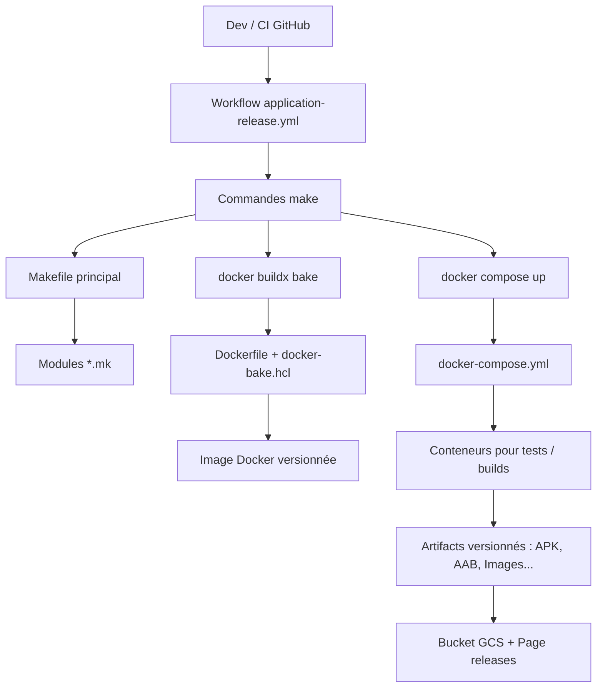

# local

<!--  -->


**Environnement DevContainer portable pour Vegito**

Ce dépôt fournit un environnement de développement conteneurisé et accéléré par GPU, conçu pour le projet Vegito.  
Il inclut une configuration prête à l’emploi pour Android Studio, les émulateurs Firebase, Clarinet (smart contracts Stacks), Vault (en mode dev), les outils GPU, et bien plus — le tout optimisé pour un usage en DevContainer (VS Code, Codespaces, etc.).

> 🔧 Actuellement supporté : **GPUs NVIDIA**  
> 💡 Le support des **GPU AMD** est bienvenu — vos PR sont les bienvenues !  
> 🧠 Pensé pour la reproductibilité, la portabilité et l’extensibilité.

---

## ⚙️ Fonctionnalités incluses

- Android Studio avec support de l’émulateur
- Emulateurs Firebase
- Vault (mode dev)
- Clarinet (Stacks)
- Tests E2E avec Robot Framework
- Intégration GCloud et builders personnalisés
- Accès graphique headless via Xpra (HTML5)
- GPU passthrough avec OpenGL / CUDA / Vulkan
- Compatible DevContainers / Codespaces

---

## 🚀 Démarrage rapide

```bash
make dev
```

Cela démarre tous les services définis dans les fichiers `docker-compose`, incluant :

- le conteneur principal `dev`,
- le backend Go,
- Firebase Emulators,
- Clarinet,
- Android Studio,
- Vault (mode dev).

---

## 📦 Structure recommandée

Intégrez ce dépôt comme un sous-dossier `local/` dans votre projet avec `git subtree` :

```bash
git subtree add --prefix local https://github.com/vegito-app/local.git main --squash
```

Votre arborescence projet ressemblera à :

```
.
├── Makefile
├── README.md
├── application/
├── local/   <- contient le DevContainer complet
```

Le `Makefile` principal inclut `local/local.mk` :

```makefile
include local/local.mk
```

---

## 🧰 Services disponibles

Utilisez `make help` pour afficher la liste des commandes disponibles.

Exemples :

```bash
make android-studio-container-start
make firebase-emulators-container-sh
make vault-dev-container-stop
```

---

## 🧠 Stack technique

| Couche       | Contenu                                       |
| ------------ | --------------------------------------------- |
| 🧰 Base      | Debian 12 + Docker + NVIDIA Container Toolkit |
| 📦 GPU       | Accès GPU via NVIDIA (passthrough)            |
| 📱 Android   | SDK Android, AVD, Flutter SDK                 |
| 🔐 Vault     | Mode dev ou cluster                           |
| 💬 SSR       | V8Go + React SSR (avec Google Maps)           |
| 🌐 Accès GUI | Xpra (Xorg + Openbox)                         |
| 🧪 CI/E2E    | Tests avec adb, emulator, Robot Framework     |

---

## 🖥️ Accélération GPU

Voir la documentation complète ici :  
[GPU Docker pour Debian + NVIDIA](docker/gpu/README.md)

```bash
DISPLAY=:1 glxinfo | grep -E "renderer|OpenGL"
```

---

## 🧪 Cas d’usage

- Tests Flutter avec Google Maps et WebView
- Rendu graphique et media dans les émulateurs
- Tests d’inférence ML dans un environnement Docker GPU
- Tests SSR avec V8Go et puppeteer
- Intégration avec Android Studio via navigateur

---

## 🔐 Authentification GCP

Pour interagir avec Firebase, Terraform, etc. :

```bash
make gcloud-auth-login-sa
```

---

## 🔧 Setup rapide

```bash
make local-android-studio-image-pull
make local-android-studio-container-sh
```

Puis dans le conteneur :

```bash
display-start-xpra.sh
```

Et ouvrez dans votre navigateur :  
http://localhost:5900/

---

## 🏗️ Organisation par couches

### 1. **CI GitHub (niveau le plus haut)**

Chaque dépôt applicatif contient un workflow `application-release.yml` basé sur un template générique partagé `application-release-template.yml`.  
Ce pipeline :

- compile l’application (mobile, backend, etc.)
- génère les artefacts (APK, AAB, images Docker…)
- publie dans un bucket GCS
- rend accessible la version via : [https://release.vegito.app](https://release.vegito.app)

Il déclenche des commandes `make` spécifiques à chaque projet.

### 2. **Makefile modulaire**

Le `Makefile` principal inclut dynamiquement tous les fichiers `*.mk` des sous-modules (`backend/`, `mobile/`, `frontend/`, etc.).  
Chaque module définit ses propres cibles via des fichiers comme :

```
mobile/flutter.mk
backend/backend.mk
```

Cela permet :

- une validation locale des builds
- une factorisation des commandes pour la CI et les devs

### 3. **Docker (build & run)**

Les commandes Make utilisent :

- `docker buildx bake` avec des `docker-bake.hcl` spécifiques
- `docker compose` avec des `docker-compose.yml` propres à chaque module

Ce système permet de :

- construire des images versionnées
- exécuter tous les services dans un réseau Docker isolé

### 4. **Environnement local et CI unifiés**

Grâce à DevContainer, l’environnement utilisé localement est **identique** à celui de la CI.  
Il permet notamment :

- le debug des services localement (Go, Flutter, Firebase, etc.)
- le test fonctionnel via RobotFramework
- l’utilisation GPU dans un conteneur

---

## 🗂️ Ajout d’une nouvelle application

Pour qu’un dépôt soit compatible avec la CI générique :

1. Créer un `Makefile` à la racine
2. Exposer les cibles attendues par la CI (`make build`, `make test`, etc.)
3. Structurer le projet par modules : `backend/`, `frontend/`, `mobile/`, `tests/`, etc.
4. Ajouter les `Dockerfile`, `docker-compose.yml` et `docker-bake.hcl` nécessaires

---

## 🧬 Schéma d’architecture


```mermaid
graph TD
  A[Dev / CI GitHub] --> B[Workflow application-release.yml]
  B --> C[Commandes make]
  C --> D[Makefile principal]
  D --> E[Modules *.mk]
  C --> F[docker buildx bake]
  C --> G[docker compose up]
  F --> H[Dockerfile + docker-bake.hcl]
  G --> I[docker-compose.yml]
  H --> J[Image Docker versionnée]
  I --> K[Conteneurs pour tests / builds]
  K --> L[Artifacts versionnés : APK, AAB, Images...]
  L --> M[Bucket GCS + Page releases]
```

---

## 📘 Conclusion

Ce système CI/Makefile/Docker modulaire garantit :

- une forte **portabilité** (local/dev/CI identiques)
- une **extensibilité** aisée (ajout de modules ou dépôts)
- une **reproductibilité** totale des builds

Il peut être repris tel quel pour tout projet Flutter/Go basé sur des conteneurs et des workflows GitHub Actions.

## 💡 Bonnes pratiques

- Ce dépôt peut être utilisé comme **template public** pour projets Flutter + Go.
- Tous les scripts Makefile sont modulaire et extensibles.
- Vous pouvez proposer des PR ou utiliser cet environnement dans vos CI/CD.

---

## 📜 Licence

MIT — utilisez, modifiez, améliorez librement.  
Voir le fichier [LICENSE](./LICENSE).

---

# 🧠 Architecture CI/CD modulaire de Vegito

Le projet **Vegito** repose sur une superposition cohérente de briques technologiques :  
CI GitHub → Makefile → Docker → Code source modulaire.

---
