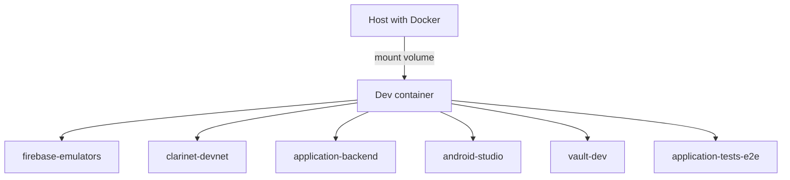
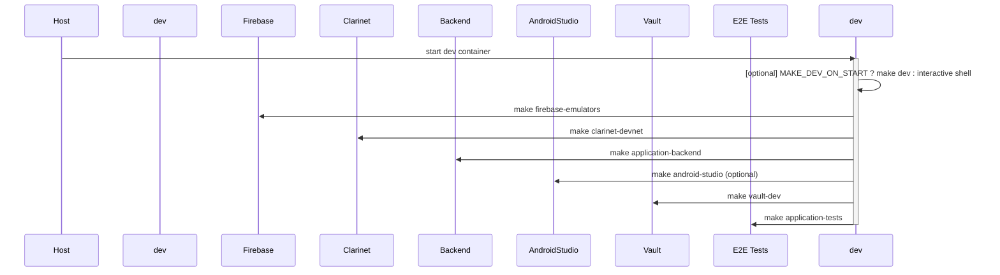

# 🚗 Refactored Winner (aka CAR2GO)

Welcome aboard! This project is a vehicle-based mobility service (backend + mobile/web) powered by modern Google Cloud architecture, secured with Vault, and designed to be pleasant to develop on.

📘 This README is also available in [🇫🇷 French](README.fr.md)

## ✨ What's inside

- **A Go backend** running on Cloud Run
- **A Flutter frontend** (mobile/web)
- **Secrets secured via Vault (GCP Auth)**
- **Infrastructure declared using Terraform**
- **A full-featured local dev environment with DevContainer**

---

## ⚙️ Getting started locally

> 💡 Prerequisites: Docker, Git, a GCP token (`GOOGLE_APPLICATION_CREDENTIALS`), and `make`.

### 1. Clone the project

```bash
git clone git@github.com:<your-org>/refactored-winner.git
cd refactored-winner
```

### 2. Start the local dev environment

```bash
make dev
```

This will either:

- Start the main `dev` container which will **automatically** run `make dev` **unless** `MAKE_DEV_ON_START=false` is set in `local/.env`.
- Or run `make dev` directly from the host, which transparently invokes the same orchestration logic in the same environment as the container.

🧰 The `dev` container is the project's main toolbox. It contains Docker CLI, `make`, `gcloud`, and other dev tools, and shares its filesystem with the host. You can develop locally with or without Codespaces—your experience remains consistent.

Here's a simplified view of the local architecture:



### 🛠️ Additional details about the local environment

The `dev` container is the main entry point for any developer. It is assumed to be launched automatically (via Codespaces or Devcontainer) and provides a unified dev experience. **It is never started or destroyed by any `Makefile`**.

Once inside the `dev` container, you can:

- launch any service individually:
  ```bash
  make firebase-emulators
  make application-backend
  make vault-dev
  make android-studio
  ```
- or run:
  ```bash
  make dev
  ```
  This simply chains the individual service targets in a defined order.

> 💡 `make dev` never creates or removes the `dev` container itself. It is always meant to be run **inside** the container, not from the host.

And the corresponding sequence diagram:



## 🔐 Vault Authentication

Locally: Vault token or AppRole auto-generated

- Config directory: `local/vault/`
- Use `make vault-dev` to start it
- Vault UI available at: http://127.0.0.1:8200/

In production (Cloud Run): authentication is done via GCP IAM (Workload Identity) using the `backend-application` role.

---

## 🔥 Firebase & Emulators

The local setup includes Firebase emulators for:

- Authentication (`auth`)
- Cloud functions (`functions`)
- Firestore database (`firestore`)

This allows safe local development without touching production Firebase.

- Config lives in: `local/firebase-emulators/`
- Launched automatically via: `make firebase-emulators`
- Emulator UI: http://127.0.0.1:4000/

📘 Learn more: [Firebase Local Emulator Suite](https://firebase.google.com/docs/emulator-suite)

---

## 🚀 Deployment

```bash
make infra-deploy-prod
```

This orchestrates:

- Terraform initialization
- Infrastructure apply to GCP
- Firebase config deployment (mobile)

---

## 🧪 Useful Make commands

| Action                        | Command                                              |
| ----------------------------- | ---------------------------------------------------- |
| Show dev container logs       | `make logsf`                                         |
| Rebuild Docker builder images | `make local-builder-image`                           |
| Apply production Terraform    | `make production-vault-terraform-apply-auto-approve` |
| Restart Vault in dev mode     | `make vault-dev`                                     |

---

## 📱 Android Studio Environment

The local dev environment provides a full-featured Android Studio setup inside a container with:

- Flutter SDK (with Dart) preinstalled
- Android SDK + NDK + selected build-tools
- Optional Chrome or Chromium
- VNC + X11 display (via xvfb, openbox, and x11vnc)
- Automatic history and cache persistence

Launch it via:

```bash
make android-studio
```

> Runs on both `linux/amd64` and `linux/arm64`. The Android emulator is available only on `amd64`.

If running inside DevContainer, connect via VNC at `localhost:5901`. Default resolution: 1440x900.

---

## 📁 Project structure

- `application/` – Go backend code
- `mobile/` – Flutter mobile/web app
- `infra/` – all infra-as-code (Terraform, Vault, GKE, etc.)
- `local/` – Docker-based development environment

---

## 🤝 Need help?

Helpful links for this stack:

- 📦 [DevContainer](https://containers.dev) – portable dev environments
- 🔐 [Vault](https://developer.hashicorp.com/vault) – secret management
- ☁️ [Terraform](https://www.terraform.io/) – infrastructure as code
- 🔄 [Cloud Run](https://cloud.google.com/run) – backend deployment
- 📱 [Flutter](https://flutter.dev) – multiplatform frontend

You can discover all available Make targets via tab completion in the DevContainer shell:

```bash
make <TAB>
```

Working on smart contracts for STX/Clarity?

- 🧱 [Clarinet](https://www.hiro.so/clarinet) – CLI for testing, simulating, and deploying Stacks smart contracts
- 📚 [Clarity Lang](https://docs.stacks.co/concepts/clarity/overview) – the smart contract language

You're in the right place. Happy hacking! ✨
