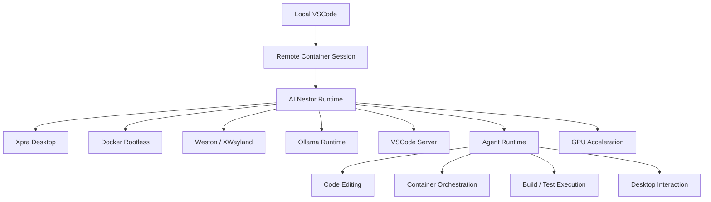

# AI Nestor

Local-first AI development runtime for autonomous coding agents.

AI Nestor is a containerized GPU-enabled development environment designed to run AI agents capable of interacting with real developer workspaces.

It combines:

- Docker-in-Docker (rootless)
- VSCode Remote Containers
- GPU acceleration (NVIDIA)
- Xpra / XWayland desktop streaming
- Ollama local LLM runtime
- Headless graphical Linux desktop
- Remote browser-accessible development sessions
- Agent-ready execution environment

The goal is to provide a reproducible local runtime where AI agents can:

- inspect repositories
- edit code
- execute commands
- run builds
- launch containers
- use graphical applications
- interact with browsers
- debug systems
- orchestrate CI/CD-like workflows

---

# Features

## GPU accelerated runtime

Supports NVIDIA GPU passthrough inside containers.

Includes:
- OpenGL
- XWayland
- Weston
- NVENC-compatible stack
- hardware accelerated streaming

---

## Full graphical Linux desktop inside Docker

AI Nestor embeds a complete Linux graphical environment:
- Xpra
- Weston
- XWayland
- Openbox
- browser-accessible desktop session

The environment can run:
- VSCode
- browsers
- terminals
- graphical debugging tools
- Android Studio
- Appium tooling

---

## VSCode inside VSCode

AI Nestor supports nested development workflows:
- local VSCode
- remote container session
- internal VSCode instance running inside the agent runtime

This architecture allows experimentation with:
- autonomous coding agents
- self-hosted copilots
- tool-using LLMs
- multi-runtime orchestration

---

## Rootless Docker-in-Docker

The runtime embeds a fully functional rootless Docker daemon.

This enables agents to:
- build images
- orchestrate compose stacks
- run isolated environments
- test CI pipelines
- manipulate containers autonomously

---

## Local AI runtime

AI Nestor integrates:
- Ollama
- local models
- GPU inference
- offline execution

The runtime is designed to progressively evolve from:
- conversational LLM usage
to:
- autonomous task execution
- repository manipulation
- developer assistance agents

---

# Architecture

```mermaid
graph TD
    A[Local VSCode] --> B[Remote Container Session]
    B --> C[AI Nestor Runtime]    
    C --> E[Xpra Desktop]
    C --> D[Docker Rootless]
    C --> F[Weston / XWayland]
    C --> G[Ollama Runtime]
    C --> H[VSCode Server]
    C --> I[Agent Runtime]
    C --> J[GPU Acceleration]
    I --> K[Code Editing]
    I --> L[Container Orchestration]
    I --> M[Build / Test Execution]
    I --> N[Desktop Interaction]
```

---

# Current status

Experimental.

The project is currently focused on:
- runtime stabilization
- GPU reliability
- desktop orchestration
- agent tooling
- autonomous workflows

---

# Vision

AI Nestor aims to become a local autonomous development platform where AI agents can interact with real-world developer environments safely and reproducibly.

Instead of isolated API-only agents, AI Nestor explores:
- full desktop interaction
- container orchestration
- graphical tooling
- real build systems
- local-first execution

---

# Screenshots

TODO

---

# License

TODO