# Images Validation Workflow

## Overview

This project implements a scalable system for managing the submission, validation, and distribution of images uploaded by users via a mobile Flutter application.

The goal is to ensure that all images are properly moderated before being shown in the app, guaranteeing content quality and compliance.

---

## System Components

- **Flutter Mobile Application**  
  Allows users to upload photos and enter descriptive data. Authentication is managed with Firebase Auth.

- **Go Backend on Cloud Run**  
  Handles incoming data submissions, stores data in Firestore, and triggers asynchronous validation workflows.

- **Google Cloud Pub/Sub**  
  Facilitates event-driven communication between components, decoupling the upload, moderation, and update steps.

- **Moderator Worker**  
  A Go-based worker subscribes to new image creation events, validates images using Google Cloud Vision SafeSearch API, and uploads approved images to a CDN bucket.

- **Firestore Database**  
  Stores image metadata including validated image URLs for frontend consumption.

---

## Workflow Description

1. **User Upload**  
   The user uploads a photo and accompanying data through the Flutter app. Requests are authenticated with Firebase Auth.

2. **Data Storage**  
   The backend receives the request and stores the photo record in Firestore.

3. **Event Publication**  
   A `image-created` event is published on Pub/Sub to signal a new entry.

4. **Image Moderation**  
   The moderator worker listens for these events, retrieves the image data, and analyzes the image for inappropriate content using the Vision API’s SafeSearch feature.

5. **Image Upload**  
   If the image passes moderation, it is uploaded to a CDN bucket for fast delivery.

6. **Validation Notification**  
   The worker publishes a `image-validated` event on Pub/Sub after successful upload.

7. **Final Update**  
   A backend service updates the Firestore record with the validated image URL, completing the process.

---

## Architecture Diagram

```mermaid
graph TD
  subgraph Flutter Mobile Application
    A1[📱 User] --> A2[📸 Upload photo + image data]
    A2 -->|Firebase Auth| A3[🌐 POST /images backend]
  end

  subgraph Go Backend on Cloud Run
    A3 --> B1[🗂️ Store Vegetable in Firestore]
    B1 --> B2[📨 Pub/Sub: image-created]
  end

  subgraph PubSub
    B2 -->|Push| C1[🛠️ Go Worker: moderator]
    C1 --> C2[🔍 Vision API: SafeSearch]
    C2 --> C3[📤 Upload image to CDN bucket]
    C3 --> C4[📨 Pub/Sub: image-validated]
  end

  subgraph Backend Update
    C4 -->|Pull Subscription| D1[🔁 Backend: listen image-validated topic]
    D1 --> D2[🗂️ Firestore: update validated image status]
  end
```

