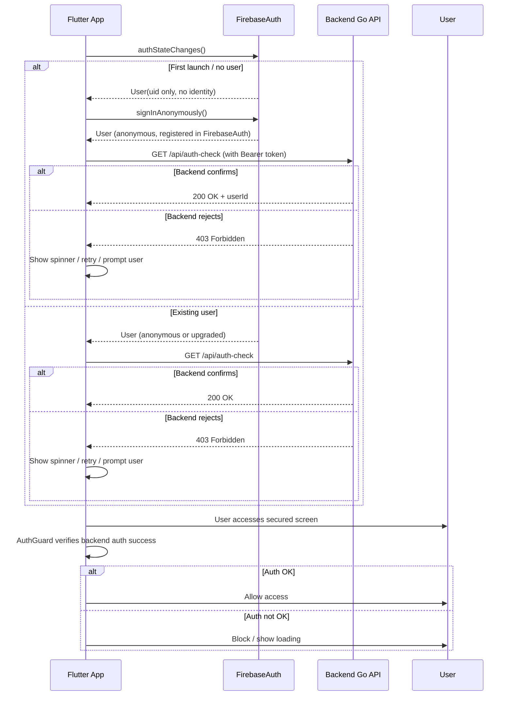

```mermaid
sequenceDiagram
    participant App as Flutter App
    participant Auth as FirebaseAuth
    participant Backend as Backend Go API

    App->>Auth: authStateChanges()
    alt First launch / no user
        Auth-->>App: User(uid only, no identity)
        App->>Auth: signInAnonymously()
        Auth-->>App: User (anonymous, registered in FirebaseAuth)
        App->>Backend: GET /api/auth-check (with Bearer token)
        alt Backend confirms
            Backend-->>App: 200 OK + userId
        else Backend rejects
            Backend-->>App: 403 Forbidden
            App->>App: Show spinner / retry / prompt user
        end
    else Existing user
        Auth-->>App: User (anonymous or upgraded)
        App->>Backend: GET /api/auth-check
        alt Backend confirms
            Backend-->>App: 200 OK
        else Backend rejects
            Backend-->>App: 403 Forbidden
            App->>App: Show spinner / retry / prompt user
        end
    end

    App->>User: User accesses secured screen
    App->>App: AuthGuard verifies backend auth success
    alt Auth OK
        App->>User: Allow access
    else Auth not OK
        App->>User: Block / show loading
    end
```