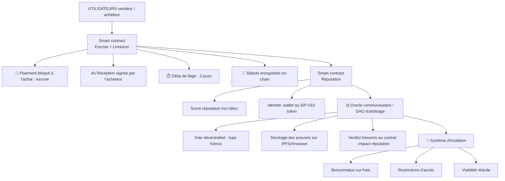
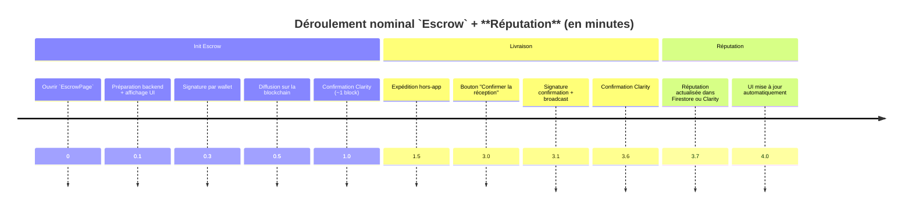

# Gestion litiges

---

# Discussion

Admettons que l'utilisateur reçoive une livraison et signe via un `smart contract` la reception ?
Comment un `smart contract` pourrait être utilisé pour gérer postérieurement un litige sans pouvoir contraindre les utilisateurs mais en les pénalisant en tant qu'utilisateur en attribuant une **réputation** à chaque utilisateur ?
Excellente question, à la croisée du droit, des `smart contracts` et des systèmes de **réputation** décentralisés.

Tu veux que la réception soit confirmée par un `smart contract`, et qu’en cas de litige postérieur, on ne puisse pas contraindre les utilisateurs (car ce n’est pas possible dans un système sans recours légal externe), mais qu’on puisse les pénaliser via une **réputation** qui influence leur futur usage du système.

Voici une approche complète, combinant `smart contract`, système de **réputation**, et gestion de **litige communautaire** :

## Scénario de base

- Livraison faite → l’utilisateur confirme via une signature (`tx` sur le `smart contract`).
- Le vendeur reçoit le paiement (ou il est débloqué d’un `escrow`).
- Tout va bien, jusqu’à ce qu’un **litige** postérieur soit initié (marchandise défectueuse, non conforme…).

## Contraintes et objectifs

- ⚠️ Aucune autorité centrale ne peut “forcer” une action.
- ✅ Il faut un système incitatif : rendre les comportements honnêtes avantageux.
- ✅ La **réputation** doit influencer les futurs usages : ex. accès à certaines fonctionnalités, frais plus élevés, visibilité moindre, etc.

## Architecture possible

### A. `Smart contract` d’achat avec `escrow` + confirmation

- Lors de l’achat :
  - Les fonds sont versés sur un contrat d'`escrow`.
  - Un délai X est défini pour contester après confirmation.
- L’utilisateur confirme la réception :
  - Soit manuellement (via `tx`),
  - Soit automatiquement après un timeout si aucune contestation n’est faite.
- Passé ce délai :
  - Les fonds sont débloqués pour le vendeur.
  - Le `smart contract` enregistre l’action comme “transaction réussie”.

### B. Système de **réputation** on-chain (ou off-chain associé à une identité on-chain)

Chaque utilisateur a un score de **réputation** calculé sur la base :

| Critère                                    | Pondération |
| ------------------------------------------ | ----------- |
| % de livraisons confirmées sans **litige** | + fort      |
| % de **litiges** ouverts                   | - fort      |
| Rôle dans des **litiges** tranchés         | variable    |

⚠️ Le score ne peut pas être modifié par coercition, mais chaque action (réclamation, **arbitrage**, etc.) impacte directement la **réputation**.

### C. Mécanisme de **litige communautaire** / **arbitral**

- Lorsqu’un utilisateur conteste après réception :
  - Il dépose une preuve hors chaîne (photo, document, etc.) sur `IPFS` ou `Arweave`.
  - Il ouvre un **litige** via une `DAO` d’**arbitrage** ou un système à la `Kleros`.
  - Un **jury** aléatoire décentralisé vote pour trancher.
    - **Jury** = utilisateurs au bon score de **réputation**.
    - Vote par engagement-révélation (`commit-reveal`) pour éviter la collusion.
- En fonction du verdict :
  - Aucun remboursement n’est forcé (car fonds déjà versés),
  - Mais la **réputation** des deux parties est impactée :
    - Vendeur jugé fautif → **réputation** diminue.
    - Acheteur jugé incompétent → **réputation** diminue.

⚠️ Cela pousse les deux parties à être honnêtes, car un mauvais score réduit leur attractivité ou leur accès au système.

## Intégration dans un écosystème

Un bon système de **réputation** est utilisé comme condition d’accès :

- Par exemple, seuls les vendeurs avec une note > 80 % peuvent vendre certains produits ou accéder à certaines marges.
- Acheteurs avec mauvaise **réputation** paient des frais plus élevés, ou voient leur délai de contestation réduit.

## Techniquement : résumé des composants

| Composant                                             | Description                                            |
| ----------------------------------------------------- | ------------------------------------------------------ |
| `Smart contract` d’`escrow`                           | Gère les fonds et les confirmations de livraison       |
| `Smart contract` de **réputation**                    | Calcule/stocke la **réputation** de chaque utilisateur |
| `DAO` ou **oracle communautaire**                     | Juge les **litiges** en mode décentralisé              |
| Système `IPFS`/`Arweave`                              | Stockage des preuves hors chaîne                       |
| Identité unique par wallet (voire preuve de personne) | Évite les sybils (multi-comptes malveillants)          |

## Exemple minimal (pseudo-code `Solidity` simplifié)

```solidity
contract Escrow {
enum Status { Created, Confirmed, Disputed, Released }
mapping(uint => Deal) public deals;

    struct Deal {
        address buyer;
        address seller;
        uint amount;
        Status status;
        uint timestamp;
    }

    function confirmReception(uint dealId) external {
        require(msg.sender == deals[dealId].buyer);
        deals[dealId].status = Status.Confirmed;
        deals[dealId].timestamp = block.timestamp;
    }

    function raiseDispute(uint dealId) external {
        require(msg.sender == deals[dealId].buyer);
        require(deals[dealId].status == Status.Confirmed);
        require(block.timestamp < deals[dealId].timestamp + 3 days);
        deals[dealId].status = Status.Disputed;
        // Emission vers un arbitre off-chain
    }

    function releaseFunds(uint dealId) external {
        require(block.timestamp > deals[dealId].timestamp + 3 days);
        require(deals[dealId].status == Status.Confirmed);
        payable(deals[dealId].seller).transfer(deals[dealId].amount);
        deals[dealId].status = Status.Released;
    }

}
```

## Avantages et limites

### Avantages

- Incitation à bien se comporter sans coercition.
- Protection postérieure possible sans centralisation.
- Système extensible (blacklists, assurances, etc.)

### Limites

- Pas de retour automatique des fonds si **litige** : nécessite un mécanisme annexe.
- Risques de sybil attack sur les **jurés** sans preuve d’identité ou **réputation** solide.
- Complexité pour l’utilisateur final (UX à soigner avec abstraction des mécanismes).

## Schéma conceptuel détaillé : Système de réception & **litiges** avec **réputation** (`Stacking` + `Clarity`)



## Détails des composants

### 1. 🔐 `Smart Contract` “Escrow + Livraison” (`Clarity`)

- Gère les achats avec fond bloqué.
- Inclut :
  - `register-order`: initier une commande.
  - `confirm-delivery`: réception par l’acheteur.
  - `raise-dispute`: initier un **litige**.
  - `release-payment`: libère fonds après délai ou **arbitrage**.

### 2. 📊 `Smart Contract` “Réputation”

- Mapping principal → score (`int`)
- Exemples de fonctions :
  - `add-reputation` / `subtract-reputation`
  - `get-reputation`
  - `blacklist-user?`

### 3. ⚖️ `DAO` ou **Oracle d’arbitrage communautaire**

- Off-chain, mais interfacé au `smart contract`.
- Les **arbitres** peuvent :
  - Voter après preuves.
  - Transmettre un `verdict-hash`.
  - Signer le résultat avec des identités on-chain.
- Exemple de techno complémentaire : `Kleros`, ou un module `DAO` custom basé sur `Clarity`.

### 4. 🧾 Preuves hors chaîne

- Les preuves sont :
  - Hébergées sur `IPFS` ou `Arweave`.
  - Associées à une transaction avec un `CID` (hash) de la preuve.
  - Utilisées par les **arbitres** pour juger.

### 5. 🎯 Mécanismes d’incitation

| **Réputation** | Effets dans le système                |
| -------------- | ------------------------------------- |
| ⭐ Haute       | Frais réduits, accès premium          |
| ⚠️ Moyenne     | Neutre                                |
| 🚫 Basse       | Accès limité, frais élevés, blacklist |

Les contrats peuvent vérifier le score avant autorisation :

```clarity
(define-read-only (can-sell (user principal))
  (>= (get-reputation user) u50))
```

## Exemple `Clarity` simplifié

```clarity
(define-map orders ((order-id uint)) ((buyer principal) (seller principal) (amount uint) (status int)))

(define-constant STATUS_CREATED 0)
(define-constant STATUS_CONFIRMED 1)
(define-constant STATUS_DISPUTED 2)
(define-constant STATUS_RELEASED 3)

(define-public (confirm-delivery (order-id uint))
  (let ((order (map-get? orders (tuple (order-id order-id)))))
    (begin
      (asserts! (is-eq tx-sender (get buyer (unwrap! order (err u100)))) (err u101))
      (map-set orders (tuple (order-id order-id))
        (merge order (tuple (status STATUS_CONFIRMED))))
      (ok true))))

(define-public (raise-dispute (order-id uint))
  ;; Ajoute l’ordre en litige et référence vers preuve IPFS
  ...
)

(define-public (adjust-reputation (user principal) (score-change int))
  ;; appelé par arbitre ou DAO
  ...
)
```

## Extensions possibles

- 🔐 Intégration `SIP-009` (`NFTs`) ou `SIP-010` (`fungible tokens`) pour staking **réputation**.
- ⛓️ `verifiable credentials` ou `soulbound tokens` pour lier **réputation** à l’identité.
- 🤖 Auto-**arbitrage** par IA déployée hors chaîne pour pré-filtrage.

## Résumé

| Élément                                 | Nature                 | Rôle                                      |
| --------------------------------------- | ---------------------- | ----------------------------------------- |
| `Smart contract` `Clarity` “Escrow”     | On-chain               | Gère paiements et statuts de livraison    |
| `Smart contract` `Clarity` “Réputation” | On-chain               | Stocke et met à jour la **réputation**    |
| `DAO` d’**arbitrage**                   | Off-chain ou sidechain | Juge les **litiges** et émet les verdicts |
| Preuves `IPFS`/`Arweave`                | Off-chain              | Fournissent les éléments de **litige**    |
| Incitations/accès                       | Off-chain ou on-chain  | Règlent l’accès selon la **réputation**   |

## Démonstration complète : contrat `Clarity` `Escrow` + **Réputation**

### Objectif du contrat

1. L’acheteur dépose des fonds dans un `escrow`.
2. Le vendeur livre un produit/service.
3. L’acheteur peut confirmer la réception ou initier un **litige**.
4. Le contrat met à jour une **réputation** on-chain pour les deux parties.
5. Un **arbitre** peut trancher un **litige** (simplifié ici).

### Code `Clarity`

```clarity
(define-data-var buyer principal tx-sender)
(define-data-var seller principal 'ST000000000000000000002AMW42H) ;; à définir dynamiquement dans une vraie app
(define-data-var escrow-amount uint u0)
(define-data-var funds-locked bool false)
(define-data-var delivered bool false)
(define-data-var confirmed bool false)
(define-data-var dispute bool false)
(define-data-var reputation-map (map principal uint))

;; Buyer initie l'escrow
(define-public (init-escrow (seller-addr principal))
  (begin
    (asserts! (not (var-get funds-locked)) (err u100)) ;; déjà initié
    (var-set buyer tx-sender)
    (var-set seller seller-addr)
    (var-set escrow-amount (stx-get-transfer-amount))
    (var-set funds-locked true)
    (ok true)
  )
)

;; Buyer transfère les fonds
(define-public (deposit)
  (let ((buyer-addr (var-get buyer)))
    (begin
      (asserts! (is-eq tx-sender buyer-addr) (err u101))
      (asserts! (not (var-get confirmed)) (err u102))
      (stx-transfer? (var-get escrow-amount) tx-sender (as-contract tx-sender))
    )
  )
)

;; Seller marque la livraison
(define-public (mark-delivered)
  (begin
    (asserts! (is-eq tx-sender (var-get seller)) (err u103))
    (var-set delivered true)
    (ok true)
  )
)

;; Buyer confirme la réception
(define-public (confirm-receipt)
  (begin
    (asserts! (is-eq tx-sender (var-get buyer)) (err u104))
    (asserts! (var-get delivered) (err u105))
    (stx-transfer? (var-get escrow-amount) (as-contract tx-sender) (var-get seller))
    (var-set confirmed true)
    (update-reputation (var-get seller) u1)
    (ok true)
  )
)

;; Buyer initie un litige
(define-public (init-dispute)
  (begin
    (asserts! (is-eq tx-sender (var-get buyer)) (err u106))
    (var-set dispute true)
    (ok true)
  )
)

;; Arbitre tranche en faveur du vendeur
(define-public (resolve-dispute (winner principal))
  (let (
        (buyer-addr (var-get buyer))
        (seller-addr (var-get seller))
       )
    (begin
      ;; Simulons que tx-sender est un arbitre autorisé
      (asserts! (is-eq tx-sender 'ST000000000000000000002ARBITR) (err u107))
      (asserts! (var-get dispute) (err u108))

      (if (is-eq winner seller-addr)
        (begin
          (stx-transfer? (var-get escrow-amount) (as-contract tx-sender) seller-addr)
          (update-reputation seller-addr u1)
          (update-reputation buyer-addr u-1)
        )
        (begin
          (stx-transfer? (var-get escrow-amount) (as-contract tx-sender) buyer-addr)
          (update-reputation buyer-addr u1)
          (update-reputation seller-addr u-1)
        )
      )
    )
  )
)

;; Mise à jour de la réputation
(define-private (update-reputation (user principal) (delta int))
  (let ((current (default-to u0 (map-get? reputation-map user))))
    (map-set reputation-map user (+ current delta))
  )
)

;; Lecture de la réputation
(define-read-only (get-reputation (user principal))
  (default-to u0 (map-get? reputation-map user))
)
```

## Résumé des acteurs

- `buyer`: l’initiateur, qui dépose les fonds.
- `seller`: le vendeur qui livre.
- `arbitre`: adresse fixe dans ce contrat, pourrait être `DAO` ou groupe de votants dans une version décentralisée.

## Possibles améliorations

- **Arbitrage** via **jury** aléatoire on-chain (`DAO`, `SIP-009`).
- Délais de livraison via bloc-height.
- **Réputation** déclinante dans le temps ou pondérée par le montant.

---

## Signature `Clarity` : frontend ou backend ?

### 1. Frontend (obligatoire pour la signature)

👉 La signature d’une transaction `Clarity` DOIT obligatoirement se faire côté utilisateur, via son wallet non-custodial (`Xverse`, `Hiro`, etc.), car :

- Seul le utilisateur détient la clé privée.
- Le backend n’a pas le droit (ni les moyens) de signer à sa place, sauf dans un système custodial, ce qui n’est pas ton cas.

Donc OUI, l’interaction avec la blockchain passe toujours par le frontend au moment de la signature.

### 2. Backend (logique métier et monitoring, PAS de signature)

Le backend :

- Peut préparer une transaction (payload, paramètres).
- Peut la transmettre au frontend via `Firebase`/`REST`.
- Peut écouter la confirmation via un `indexer` ou `WebSocket`.
- Peut déclencher automatiquement certaines actions (timeouts, **arbitrage**, **réputation**) via un wallet administratif (non utilisateur).

Exemples :

- Si un **litige** n’est pas résolu dans les 48h, un backend worker appelle `resolve-dispute` avec la clé d’un **arbitre** (ce wallet-là peut être géré par `Vault`).
- Le backend n’intervient jamais pour signer à la place d’un utilisateur.

## UX sans friction : meilleures pratiques

| Étape                           | Détail                                                                |
| ------------------------------- | --------------------------------------------------------------------- |
| Préparer la transaction côté Go | Générer les bons paramètres (`ClarityValue`), identifiant de contrat. |
| Transmettre au frontend         | Via `Firestore` ou `REST API`.                                        |
| Signer dans le wallet           | `Flutter SDK` ou `WebView` vers `Hiro Connect` ou `Xverse SDK`.       |
| Éviter les temps morts          | Animer l’attente, afficher état de broadcast, et confirmation.        |
| Ne pas bloquer l’UI             | Utiliser async + retours `Firestore` pour mise à jour en temps réel.  |

## Illustration du flow

Utilisateur clique "Initier `Escrow`"  
↓  
`Flutter` appelle backend (préparation)  
↓  
Backend retourne les paramètres (adresse, fonction, args)  
↓  
`Flutter` appelle `wallet.signAndBroadcast(...)`  
↓  
Transaction `Clarity` est diffusée  
↓  
`Stacking SDK` ou backend écoute la blockchain (event confirmation)  
↓  
`Firestore` est mis à jour (status = initiated, txid = ...)  
↓  
UI reflète l’état automatiquement

## Résumé

- ✅ Signature = frontend uniquement, car la seed reste privée
- 🔁 Backend = monitoring, timeout, arbitrage (avec wallet dédié)
- 🎯 UX fluide = préparation backend + SDK Flutter natif pour signer

Souhaites-tu que je t’aide à mettre en place le bridge Flutter ↔ Wallet STX (par ex. Hiro Connect ou Xverse Wallet SDK pour Flutter) ?

---

## Déroulement typique : timeline (~5 minutes)

### Hypothèses nominales :

- Utilisateur connecté (`Firebase` + wallet `STX` déjà appairé)
- Paiement signé immédiatement
- Livraison validée rapidement
- **Réputation** mise à jour côté `Clarity` ou `Firestore`

### Diagramme Mermaid timeline



## Explications complémentaires :

- 0.1 min : temps backend pour générer le payload et renvoyer vers frontend.
- 0.5 min : inclut signature + envoi dans mempool + confirmation (Stacks a des blocs toutes ~30s à 1 min).
- 1.5 à 3 min : temps de livraison réel, arbitraire ici (ex. livraison d’un fichier, d’un service en ligne, etc.)
- 3.6 min : la confirmation de confirm-delivery peut aussi prendre ~1 bloc.

### Résumé textuel

| Étape                             | Temps approximatif |
| --------------------------------- | ------------------ |
| Init `Escrow` (UI à confirmation) | 1 min              |
| Livraison réelle                  | ~1.5 – 2 min       |
| Confirmation + **réputation**     | ~1 min             |
| **Total nominal**                 | **~5 min**         |
