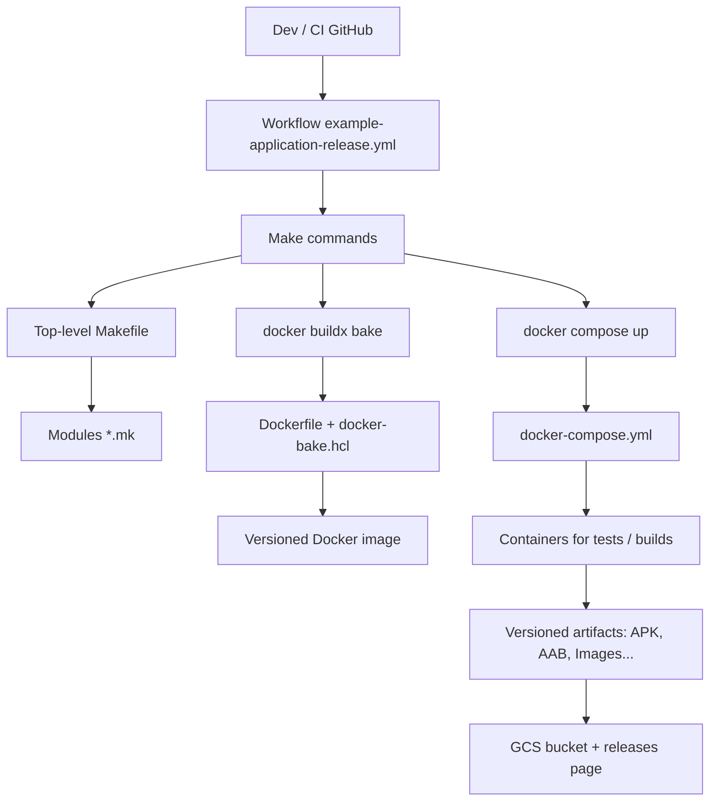

# Example Application

🔗 **[Download from GCS release bucket of project `local` – version `v1.1.0`](https://release.vegito.app/releases?project=local&version=v1.1.0)**

### 📱 Download and Preview

<div style="display: flex; align-items: center; gap: 1.5rem; flex-wrap: wrap;">
  <div style="text-align: center;">
    
    <div>
      ➡️
      <a
        href="https://storage.googleapis.com/vegito-app-prod-github-actions-ci-artifacts/vegito-app/example-application/v1.1.0/app-release.apk"
        >Download APK</a
      >
    </div>
  </div>
  <div>
    
  </div>
</div>

#### example-application-backend

The _example_application-backend_ serves an _example_application-frontend_ web react example-application.

Start _example_application-backend_:

```
make example-application-backend-run
```

Build _example_application-backend_ image:

```
make example-application-backend-image
```

Run _example_application-backend_ docker-compose service container from the _example_application-backend-image_.

```
make example-application-backend-docker-compose-run
```

Some other companion Makefile targets in familly `example-application-backend-*` are also available, see [example-application/backend/backend.mk](example-application/backend/backend.mk) for details.

    example-application-backend-docker-compose-logs
    example-application-backend-docker-compose-rm
    example-application-backend-docker-compose-run
    example-application-backend-docker-compose-stop
    example-application-backend-docker-compose-up
    example-application-backend-docker-compose-rm
    example-application-backend-image
    example-application-backend-image-push
    example-application-backend-image-push-ci
    example-application-backend-install
    example-application-backend-run

#### example-application-frontend

As mentionned above the _application-frontend_ web react app is served by the _application-backend_ server.

Application is available at:

- [http://localhost:8080](http://localhost:8080) for the standard react example-application.
- or [http://localhost:8080/ui](http://localhost:8080/ui) for the server-side pre-rendered react example-application.

Some othe companion Makefile targets in familly `example-application-frontend-*` are available, see [example-application/frontend/frontend.mk](example-application/frontend/frontend.mk) for details.

#### example-application-mobile

A mobile cross platform _iOS_ and _Android_ _mobile-application_ using [Flutter](https://flutter.dev) is also available.

See [example-application/mobile/flutter.mk](example-application/mobile) folder for more details about the available `example-application-mobile-*` targets.

As an example, get _application-mobile_ Flutter dependancies with:

```bash
$ make example-application-mobile-flutter-pub-get
```

# 🚀 CI/CD Structure & Application Modularity

The **Vegito** project is built on a coherent layered stack of technologies: GitHub CI → Makefile → Docker → modular source code.

---

## 🏗️ Layered organization

### 1. **GitHub CI (top level)**

Each example-application repository contains an `example-application-release.yml` workflow that uses the shared template `example-application-release-template.yml`.

This pipeline:

- builds the example-application (mobile, backend, etc.)
- produces versioned artifacts (APK, AAB, Docker images, ...)
- uploads artifacts to a GCS bucket
- exposes the release via: [https://releases.vegito.app](https://releases.vegito.app)

It triggers `make` targets that are specific to each project.

### 2. **Modular Makefile**

The top-level `Makefile` dynamically includes `*.mk` files from submodules (`backend/`, `mobile/`, `frontend/`, ...).
Each module exposes its own targets through files such as:

```
mobile/flutter.mk
backend/backend.mk
```

Benefits:

- local validation of builds
- command factorization for CI and developers
- flexibility: each example-application only needs to expose the targets required by CI

### 3. **Docker (build & run)**

Make targets use:

- `docker buildx bake` with module-specific `docker-bake.hcl`
- `docker compose` with module-specific `docker-compose.yml`

This enables:

- building versioned images
- running all services inside an isolated Docker network

### 4. **Unified local & CI environment**

With DevContainer, the local environment is **identical** to the CI runtime. It enables:

- local debugging of services (Go, Flutter, Firebase, ...)
- functional testing (RobotFramework)
- GPU usage inside containers

---

## 🗂️ Adding a new example-application

To make a repository compatible with the generic CI pipeline:

1. Add a `Makefile` at the repository root
2. Expose the CI-expected targets (`make build`, `make test`, ...)
3. Organize the code into modules: `backend/`, `frontend/`, `mobile/`, `tests/`, etc.
4. Add the necessary `Dockerfile`, `docker-compose.yml` and `docker-bake.hcl`

---

## 🧬 Architecture diagram



---

## 📘 Conclusion

This modular CI / Makefile / Docker system ensures:

- strong **portability** (local/dev/CI parity)
- easy **extensibility** (add modules or repos)
- full **reproducibility** of builds

It can be reused as-is for any Flutter/Go containerized project using GitHub Actions.

---

# 🌱 Vision & Philosophy

This project serves as the foundation for a powerful dev experience:

- As a **portable open-source kit** for Android/GPU developers
- As a **base layer** for building SaaS platforms:
  - Provision remote GPU-powered Android workspaces
  - Run ephemeral builds/tests with GPU emulation
  - Power SSR previews for design+QA workflows

---

## 🧪 Use Cases

- 🚀 Mobile emulator testing with real OpenGL (no CPU lag)
- 🎥 Flutter + Maps integration preview
- 🧠 ML inferencing with shared GPU
- 🧪 CI pipelines with rendering tests
- ☁️ Remote dev with full graphical support

---

## 💡 Best Practices

- The environment is designed to be **reproducible**, **shared**, and **modular**.
- Feel free to create your own `make` commands or `.mk` files in `local` as needed.
- If you have any questions or suggestions for improvement: open an issue or contact the infra team.

---

## 📜 License

MIT — use freely, contribute openly, and stay sharp – see the [LICENSE](./LICENSE) file.
