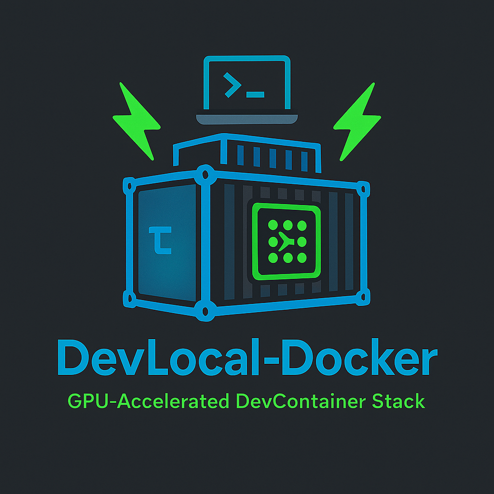

# local

<!--  -->


**Environnement DevContainer portable pour Vegito**

Ce dépôt fournit un environnement de développement conteneurisé et accéléré par GPU, conçu pour le projet Vegito.  
Il inclut une configuration prête à l’emploi pour Android Studio, les émulateurs Firebase, Clarinet (smart contracts Stacks), Vault (en mode dev), les outils GPU, et bien plus — le tout optimisé pour un usage en DevContainer (VS Code, Codespaces, etc.).

> 🔧 Actuellement supporté : **GPUs NVIDIA**  
> 💡 Le support des **GPU AMD** est bienvenu — vos PR sont les bienvenues !  
> 🧠 Pensé pour la reproductibilité, la portabilité et l’extensibilité.

---

## ⚙️ Fonctionnalités incluses

- Android Studio avec support de l’émulateur
- Emulateurs Firebase
- Vault (mode dev)
- Clarinet (Stacks)
- Tests E2E avec Robot Framework
- Intégration GCloud et builders personnalisés
- Accès graphique headless via Xpra (HTML5)
- GPU passthrough avec OpenGL / CUDA / Vulkan
- Compatible DevContainers / Codespaces

---

## 🚀 Démarrage rapide

```bash
make dev
```

Cela démarre tous les services définis dans les fichiers `docker-compose`, incluant :

- le conteneur principal `dev`,
- le backend Go,
- Firebase Emulators,
- Clarinet,
- Android Studio,
- Vault (mode dev).

---

## 📦 Structure recommandée

Intégrez ce dépôt comme un sous-dossier `local/` dans votre projet avec `git subtree` :

```bash
git subtree add --prefix local https://github.com/vegito-app/local.git main --squash
```

Votre arborescence projet ressemblera à :

```
.
├── Makefile
├── README.md
├── application/
├── local/   <- contient le DevContainer complet
```

Le `Makefile` principal inclut `local/local.mk` :

```makefile
include local/local.mk
```

---

## 🧰 Services disponibles

Utilisez `make help` pour afficher la liste des commandes disponibles.

Exemples :

```bash
make android-studio-container-start
make firebase-emulators-container-sh
make vault-dev-container-stop
```

---

## 🧠 Stack technique

| Couche       | Contenu                                       |
| ------------ | --------------------------------------------- |
| 🧰 Base      | Debian 12 + Docker + NVIDIA Container Toolkit |
| 📦 GPU       | Accès GPU via NVIDIA (passthrough)            |
| 📱 Android   | SDK Android, AVD, Flutter SDK                 |
| 🔐 Vault     | Mode dev ou cluster                           |
| 💬 SSR       | V8Go + React SSR (avec Google Maps)           |
| 🌐 Accès GUI | Xpra (Xorg + Openbox)                         |
| 🧪 CI/E2E    | Tests avec adb, emulator, Robot Framework     |

---

## 🖥️ Accélération GPU

Voir la documentation complète ici :  
[GPU Docker pour Debian + NVIDIA](docker/gpu/README.md)

```bash
DISPLAY=:1 glxinfo | grep -E "renderer|OpenGL"
```

---

## 🧪 Cas d’usage

- Tests Flutter avec Google Maps et WebView
- Rendu graphique et media dans les émulateurs
- Tests d’inférence ML dans un environnement Docker GPU
- Tests SSR avec V8Go et puppeteer
- Intégration avec Android Studio via navigateur

---

## 🔐 Authentification GCP

Pour interagir avec Firebase, Terraform, etc. :

```bash
make gcloud-auth-login-sa
```

---

## 🔧 Setup rapide

```bash
make local-android-studio-image-pull
make local-android-studio-container-sh
```

Puis dans le conteneur :

```bash
display-start-xpra.sh
```

Et ouvrez dans votre navigateur :  
http://localhost:5900/

---

## 💡 Bonnes pratiques

- Ce dépôt peut être utilisé comme **template public** pour projets Flutter + Go.
- Tous les scripts Makefile sont modulaire et extensibles.
- Vous pouvez proposer des PR ou utiliser cet environnement dans vos CI/CD.

---

## 📜 Licence

MIT — utilisez, modifiez, améliorez librement.  
Voir le fichier [LICENSE](./LICENSE).
