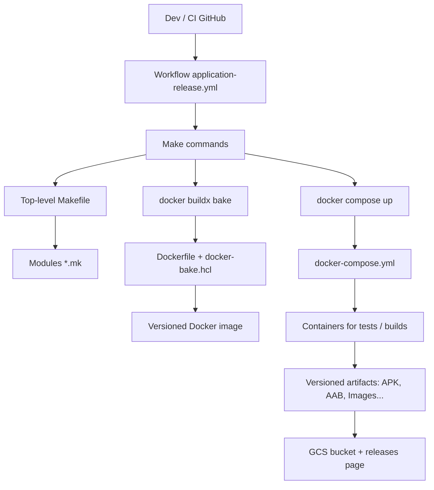

# local

<!--  -->


**Portable DevContainer Environment for Vegito**

This repository offers a **GPU-accelerated, containerized development environment** tailored for the Vegito project.
It includes ready-to-use setups for Android Studio, Firebase emulators, smart contracts with Clarinet, Vault (in dev mode), and GPU tools — all optimized for use inside DevContainers (VS Code, Codespaces, etc.).

> 🔧 **Currently supports NVIDIA GPUs**.  
> 💡 **PRs for AMD GPU support are welcome!**  
> 🧠 Built for reproducibility, portability, and extensibility.

## 🚀 Quick Links

- [Usage](#usage)
- [Subtree Integration](#subtree-integration)
- [Setup Steps](#setup)
- [GPU Rendering Verification](#gpu-acceleration-success-example)
- [Docker Stack Layers](#devlocal-docker-gpu-stack)
- [Quick Start](#quick-start)
- [Local Services](#local-services-available-commands)
- [CI/CD Structure](#cicd-structure--application-modularity)
- [Vision](#vision--philosophy)
- [Best Practices](#best-practices)
- [License](#license)

---

## Usage

Clone this repo and launch the devcontainer in VSCode.  
Run `make help` for available targets.

---

## Subtree Integration

Integrate this repository into your project as a folder named `local`, `.local`, `dev`, etc.

Example using git subtree:

```bash
git subtree add --prefix local https://github.com/vegito-app/local.git main --squash
```

Depending on your project, `tree` should now show something like:

```
dev@94476426acc6:/workspaces/my-project$ tree -L 1 .
.
|-- CHANGELOG.md
|-- Makefile
|-- README.md
|-- application
|-- docs
|-- infra
|-- local  <----- your project now embeds a git subtree folder of this repository
```

Makefile targets are available by including `local.mk` from the top-level Makefile:

```makefile
include local/local.mk
```

---

## ✨ Features

- ⚡ **GPU-accelerated Android Emulator** (e.g. Google Maps, camera, media)
- 🧠 **AI/ML-compatible GPU runtime** (CUDA, OpenGL, Vulkan-ready)
- 🐋 **Headless container** powered by Docker + Xorg + Xpra
- 🎯 **OpenGL via NVIDIA GPU passthrough**
- 🧪 **Emulator testing & CI pipeline-ready**
- 🪄 **Devcontainers compatible** (VS Code, GitHub Codespaces)
- 🌐 **Web-based GUI access** via Xpra HTML5
- 🔄 **Composable Docker build system** with Makefile targets

---

# 💻 Dev Environment Overview

Welcome to **DevLocal-Docker**, a fully portable, GPU-accelerated local development stack designed for high-performance Flutter + Android + GPU projects. This stack provides a complete development environment, including Android Studio with emulator support, GPU rendering, server-side rendering with V8Go, and full headless compatibility via Xpra + Xorg.

---

## 📦 Components

| Layer           | Stack                                                 |
| --------------- | ----------------------------------------------------- |
| 🧰 Base         | Debian 12 + Docker + NVIDIA Container Toolkit         |
| 🧠 GPU          | NVIDIA RTX / CUDA-enabled environment                 |
| 📱 Mobile Dev   | Android SDK, Emulator, Flutter SDK                    |
| 🧠 SSR          | V8Go + React SSR                                      |
| 🎮 GUI Headless | Xorg + Openbox + Xpra with web VNC support            |
| 🧪 Testing      | Automated emulator testing via `glxinfo`, `adb`, etc. |

---

## 🔧 Setup

### 1. Build and run the container

```bash
# 1. Build and run the container
make local-android-studio-image-pull
make local-android-studio-container-sh
```

### 2. Inside the container, start the display

```bash
display-start-xpra.sh
```

### 3. Access the desktop via browser

Open [http://localhost:5900/](http://localhost:5900/) in your web browser.

---

## 🖥️ GPU Acceleration (Success Example)

To use GPU acceleration in Docker containers, installation steps are available here: [NVIDIA GPU Docker Setup for Debian Bookworm](docker/gpu/README.md).

Verify GPU rendering from inside the container:

```bash
DISPLAY=:1 glxinfo | grep -E "renderer|OpenGL"
```

Expected output (example):

```
OpenGL vendor string: NVIDIA Corporation
OpenGL renderer string: NVIDIA GeForce RTX 2080 Ti/PCIe/SSE2
OpenGL core profile version string: 4.6.0 NVIDIA 535.247.01
...
```

---

## 🚀 Quick Start

```bash
make dev
```

This command starts all services defined in `docker-compose.yml`, including:

- the main `dev` container (your shell and workspace)
- the application backend
- Firebase emulators
- Clarinet (smart contracts)
- Android Studio
- Vault (dev mode)

Once the `dev` container is running, you can execute all usual `make` commands **from inside the container**, or use automatic integration if you are in a **VSCode DevContainer**.

> 💡 Tip: You can also launch the project via the "Open in Container" interface in VSCode, which automatically uses `make dev`.

---

## 🔐 GCP Authentication

To interact with cloud infrastructure (Firebase, Terraform, etc.), you need to authenticate.

Use:

```bash
make gcloud-auth-login-sa
```

---

## 🧰 Local Services: Available Commands

Each service started via `docker-compose` has **dedicated `make` commands**. From inside the `dev` container, for example:

```bash
make android-studio-container-start     # Start Android Studio
make android-studio-container-logs      # View logs
make android-studio-container-sh        # Shell into the container
make android-studio-container-stop      # Stop the service
```

The same logic applies to:

- Clarinet (Clarity contracts)
- Vault (secret storage)
- Firebase Emulators
- The Go backend, etc.

#### Next steps

- Add a VPN and/or SSH container to the container set to provide an integrated entrypoint usable from the internet with minimal configuration.

---

# 🚀 CI/CD Structure & Application Modularity

The **Vegito** project is built on a coherent layered stack of technologies: GitHub CI → Makefile → Docker → modular source code.

---

## 🏗️ Layered organization

### 1. **GitHub CI (top level)**

Each application repository contains an `application-release.yml` workflow that uses the shared template `application-release-template.yml`.

This pipeline:

- builds the application (mobile, backend, etc.)
- produces versioned artifacts (APK, AAB, Docker images, ...)
- uploads artifacts to a GCS bucket
- exposes the release via: [https://releases.vegito.app](https://releases.vegito.app)

It triggers `make` targets that are specific to each project.

### 2. **Modular Makefile**

The top-level `Makefile` dynamically includes `*.mk` files from submodules (`backend/`, `mobile/`, `frontend/`, ...).
Each module exposes its own targets through files such as:

```
mobile/flutter.mk
backend/backend.mk
```

Benefits:

- local validation of builds
- command factorization for CI and developers
- flexibility: each application only needs to expose the targets required by CI

### 3. **Docker (build & run)**

Make targets use:

- `docker buildx bake` with module-specific `docker-bake.hcl`
- `docker compose` with module-specific `docker-compose.yml`

This enables:

- building versioned images
- running all services inside an isolated Docker network

### 4. **Unified local & CI environment**

With DevContainer, the local environment is **identical** to the CI runtime. It enables:

- local debugging of services (Go, Flutter, Firebase, ...)
- functional testing (RobotFramework)
- GPU usage inside containers

---

## 🗂️ Adding a new application

To make a repository compatible with the generic CI pipeline:

1. Add a `Makefile` at the repository root
2. Expose the CI-expected targets (`make build`, `make test`, ...)
3. Organize the code into modules: `backend/`, `frontend/`, `mobile/`, `tests/`, etc.
4. Add the necessary `Dockerfile`, `docker-compose.yml` and `docker-bake.hcl`

---

## 🧬 Architecture diagram



---

## 📘 Conclusion

This modular CI / Makefile / Docker system ensures:

- strong **portability** (local/dev/CI parity)
- easy **extensibility** (add modules or repos)
- full **reproducibility** of builds

It can be reused as-is for any Flutter/Go containerized project using GitHub Actions.

---

# 🌱 Vision & Philosophy

This project serves as the foundation for a powerful dev experience:

- As a **portable open-source kit** for Android/GPU developers
- As a **base layer** for building SaaS platforms:
  - Provision remote GPU-powered Android workspaces
  - Run ephemeral builds/tests with GPU emulation
  - Power SSR previews for design+QA workflows

---

## 🧪 Use Cases

- 🚀 Mobile emulator testing with real OpenGL (no CPU lag)
- 🎥 Flutter + Maps integration preview
- 🧠 ML inferencing with shared GPU
- 🧪 CI pipelines with rendering tests
- ☁️ Remote dev with full graphical support

--- 

## 💡 Best Practices

- The environment is designed to be **reproducible**, **shared**, and **modular**.
- Feel free to create your own `make` commands or `.mk` files in `local` as needed.
- If you have any questions or suggestions for improvement: open an issue or contact the infra team.

---

## 📜 License

MIT — use freely, contribute openly, and stay sharp – see the [LICENSE](./LICENSE) file.
