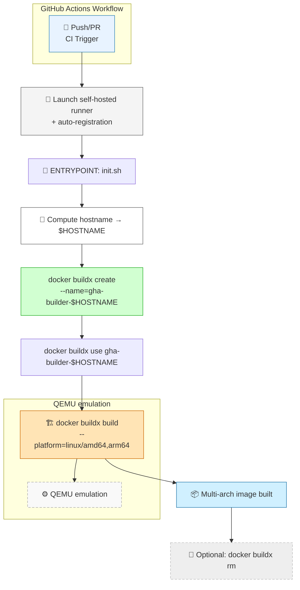

## 🏗️ Architecture des runners GitHub Actions auto-isolés

> Chaque runner CI démarre dans un conteneur Docker isolé et enregistre dynamiquement un builder `buildx` nommé selon son `$HOSTNAME`.

Ce design permet :
- le support multi-arch via QEMU
- une isolation forte entre runners
- une scalabilité horizontale
- et un cache par builder

