# Mobile application

## Recoverable Wallet

A new Flutter project.

```mermaid
sequenceDiagram
    participant Utilisateur
    participant App (Mobile)
    participant Backend (Firestore)

    Utilisateur->>App (Mobile): Connexion
    App (Mobile)->>App (Mobile): Génère Private Key
    App (Mobile)->>App (Mobile): Génère Recovery Key
    App (Mobile)->>App (Mobile): XOR (Private Key, Recovery Key) → XorKey
    App (Mobile)->>Backend (Firestore): Envoie XorKey (jamais Recovery Key)
    App (Mobile)->>Utilisateur: Affiche Recovery Key et demande de la sauvegarder
    Utilisateur-->>App (Mobile): Stocke Recovery Key manuellement

    Note right of Backend (Firestore): Stocke seulement XorKey

    Utilisateur->>App (Mobile): Tentative de récupération
    App (Mobile)->>Backend (Firestore): Récupère XorKey
    Utilisateur->>App (Mobile): Fournit Recovery Key
    App (Mobile)->>App (Mobile): XOR (XorKey, Recovery Key) → Private Key retrouvée 🎉
```

## Getting Started

This project is a starting point for a Flutter application.

A few resources to get you started if this is your first Flutter project:

- [Lab: Write your first Flutter app](https://docs.flutter.dev/get-started/codelab)
- [Cookbook: Useful Flutter samples](https://docs.flutter.dev/cookbook)

For help getting started with Flutter development, view the
[online documentation](https://docs.flutter.dev/), which offers tutorials,
samples, guidance on mobile development, and a full API reference.

## Vegetables Market

## 📱 Mobile hybrid data Architecture: Vegetable Flow

In this app, the `Vegetable` objects follow a hybrid architecture combining Firestore's real-time capabilities with backend-enforced logic.

### 🔄 Write flow (creation/update)

- All mutations (create/update/delete) of `Vegetable` objects are done via the **Go backend API** (`Cloud Run`).
- The mobile app never writes directly to Firestore for these entities.
- The backend performs filtering, moderation, validation, and persists sanitized data to Firestore.

### 👁️ Read flow (real-time sync)

- The mobile app listens **directly to Firestore** (via Provider/StreamBuilder).
- This enables seamless and reactive UI updates when vegetables are added, modified, or removed.

### 🔒 Security and control

- Firestore write access is restricted to the backend service account.
- Reads from Firestore are protected by Firestore security rules (based on user identity if needed).
- This allows a safe, scalable, and maintainable architecture while leveraging Firestore's strengths.

### 📷 Image moderation logic

- The mobile app uploads images to Firebase Storage and provides the temporary `imageStatus` in the payload to the backend.
- In production, the backend:
  - Processes and filters the image,
  - Stores the filtered version in a secure CDN (GCS bucket),
  - Updates Firestore with the final `imageStatus`.
- A custom prefix filter ensures only approved images are shown in the UI.
