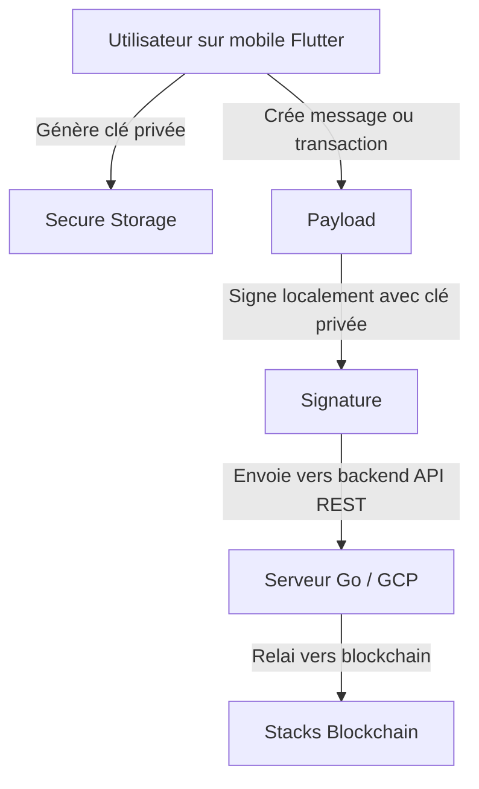

# 🔐 Architecture du wallet non-custodial (Stacks / Clarity) côté client

Ce dossier contient la logique de gestion cryptographique du portefeuille Stacks (non-custodial) côté **Flutter (frontend mobile)**.

---

## ✅ Principes de sécurité

- Les **clés privées** sont **générées localement** sur l’appareil de l’utilisateur.
- Elles sont **stockées dans un coffre sécurisé** :
  - iOS : Secure Enclave / Keychain
  - Android : Android Keystore
- **Aucune donnée privée n’est transmise au backend** (ni clé privée, ni seed, ni mot de passe).

---

## 🔁 Cycle de vie d'une transaction



---

## 📦 Fonctions Dart typiques (dans ce dossier)

- `generatePrivateKey()` : génère une clé ECDSA SECP256k1
- `getPublicKeyFromPrivateKey()` : calcule la clé publique compressée
- `getStacksAddress()` : déduit l’adresse STX (mainnet/testnet)
- `signMessage()` : signe un message ou une transaction Clarity
- `verifySignature()` : vérifie une signature côté client si besoin

---

## 🔍 Vérification backend

Le backend **ne signe jamais**. Il peut :
- Vérifier une signature avec la clé publique
- Récupérer une transaction signée depuis le client
- L’envoyer à la blockchain Stacks (via API Hiro ou node perso)

---

## 🛡️ Pourquoi c’est non-custodial ?

- Aucune donnée sensible n’est connue ni stockée par le backend
- Le pouvoir de signature est **entièrement entre les mains de l’utilisateur**
- Conforme aux exigences de non-custody (pas besoin d’enregistrement PSAN)

---

## 🧪 Sécurité avancée (XOR split)

Une technique de protection additionnelle peut être utilisée pour "cacher" une clé privée en la divisant en deux morceaux à l’aide d’un XOR binaire :

- La clé privée est transformée en deux fragments `part1` et `part2` :
  ```
  privateKey = part1 ⊕ part2
  ```
- Tant qu’un seul des deux morceaux est connu, la clé privée reste totalement inconnue.
- Cela permet de stocker chaque moitié séparément (ex: part1 dans le stockage local sécurisé, part2 dans une sauvegarde chiffrée ailleurs).

✳️ **Important** :
- Le XOR est sécurisé **uniquement si l’un des deux morceaux est imprévisible (aléatoire)**.
- Ce mécanisme n’est pas un chiffrement en soi, mais une forme de _secret sharing_ minimaliste.

Exemple en pseudo-code :
```dart
List<int> part1 = generateRandomBytes();
List<int> part2 = xor(part1, privateKey);
// Plus tard : privateKey = xor(part1, part2);
```