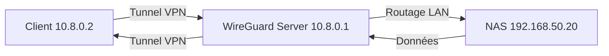
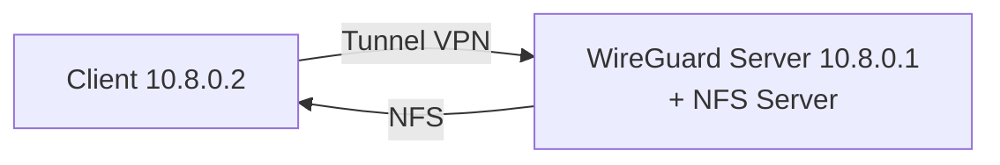
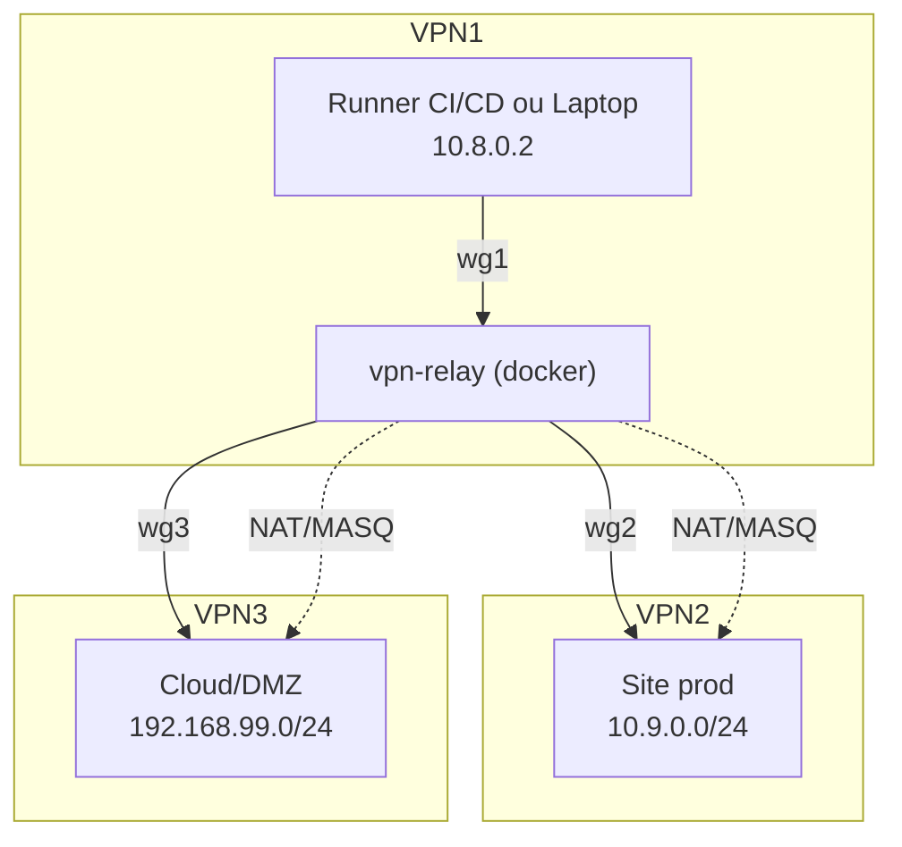
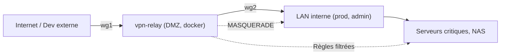
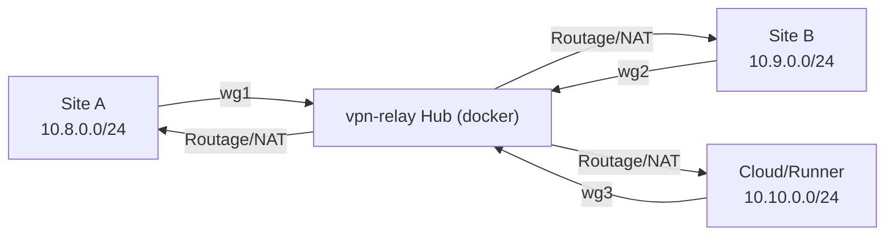
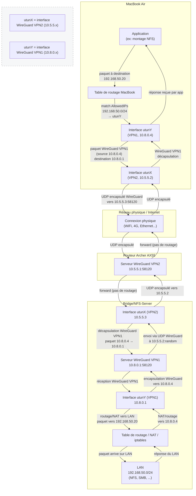
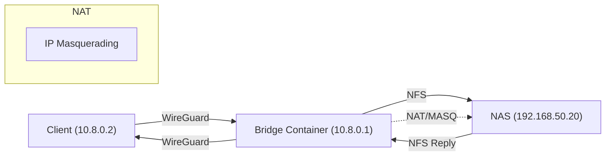

 [](https://hub.docker.com/r/dbndev/nfs-wireguard-bridge)

# 🚦 NFS WireGuard Bridge

**Serveur NFS sécurisé derrière WireGuard pour exposer vos dossiers locaux à distance, sans compromis sur la sécurité ni la performance.**  
Partagez vos environnements de développement, projets, volumes Docker ou données sensibles entre plusieurs machines, même à travers Internet ou NAT.

---

## Sommaire / Table of Contents

- [🚀 Features / Fonctionnalités](#-features--fonctionnalités)  
- [⚡️ Quick Start / Démarrage rapide](#️-quick-start--démarrage-rapide)  
- [🛠️ Use Cases / Cas d’usage](#️-use-cases--cas-dusage)  
- [🔧 Personnalisation / Customization](#-personnalisation--customization)  
- [📝 Dépendances / Dependencies](#-dépendances--dependencies)  
- [🏆 Avantages WireGuard / WireGuard Benefits](#-avantages-wireguard--wireguard-benefits)  
- [❤️ Merci / Contribution / Thanks](#-merci--contribution--thanks)  
- [🇬🇧 English Summary](#-english-summary)  
- [🔗 Licence / License](#-licence--license)  

---

## 🚀 Features / Fonctionnalités

- **NFSv3** exposé derrière **WireGuard** VPN (pas besoin d’ouvrir vos ports sur Internet)  
- Montage NFS natif performant (lecture/écriture)  
- Accès distant **sécurisé** (chiffrement WireGuard, port UDP configurable)  
- Prêt pour macOS, Linux, devcontainers, Docker, etc.  
- Utilisable en mode "bridge", "bastion", ou microservice dans un Compose/Swarm/K8s  
- 🔒 Tous les ports RPC NFS sont fixés (pour VPN/NAT/Cloud)  

### Example d'utilisation : accès à un NAS distant



---

### 📡 Schéma de fonctionnement / Architecture diagram

```
┌──────────────┐         WireGuard (VPN)         ┌──────────────┐
│  Laptop Mac  │  <───────────────────────────>  │  NFS Server  │
│ (Client WG)  │        UDP/51820 + NFS          │ (Docker Host)│
└──────────────┘                                 └──────────────┘
```

---

## 🧭 Deux modes d’utilisation : NFS embarqué vs Bridge NFS vers NAS

Ce projet propose deux modes d’utilisation principaux pour exposer vos dossiers via NFS sécurisé par WireGuard :

### Mode 1 : NFS embarqué

Dans ce mode, le serveur NFS tourne directement dans le container WireGuard, exposant les dossiers locaux du host.

- **Avantages**  
  - Simplicité de déploiement : tout est dans un seul container  
  - Idéal pour partager des dossiers locaux du host  
  - Configuration centralisée dans le container WireGuard  

- **Limites**  
  - Les performances peuvent être limitées selon la charge du container  
  - Moins adapté si vous avez déjà un NAS ou un serveur NFS dédié  



### Mode 2 : Bridge NFS vers NAS

Ici, le container WireGuard agit comme un pont VPN vers un NAS ou serveur NFS existant sur le LAN.

- **Avantages**  
  - Permet d’accéder à un NAS distant sans exposer ses ports sur Internet  
  - Performance native du NAS, pas de surcharge dans le container WireGuard  
  - Flexibilité pour intégrer des infrastructures existantes  

- **Limites**  
  - Nécessite un NAS ou serveur NFS déjà en place sur le réseau local  
  - Configuration réseau et routage un peu plus complexe  


---

## ⚡️ Quick Start / Démarrage rapide

### 1. Build & Run

```bash
git clone https://github.com/dbndev/nfs-wireguard-bridge.git
cd nfs-wireguard-bridge
make build
make server-up
```

- Les dossiers `/workspaces` et `/runner` du host seront exposés via NFS derrière le VPN WireGuard.  
- Le fichier de configuration WireGuard client est généré automatiquement dans `./state/macbook.conf`.  

---

### 2. Configurer votre client WireGuard (Macbook, PC, autre serveur)

- Récupérez le fichier généré :

```bash
docker cp nfs-wireguard-bridge:/state/macbook.conf ./macbook.conf
```

- Importez ce fichier dans WireGuard sur votre machine cliente.

---

### 3. Monter le dossier NFS

Sur Mac/Linux, exécutez :

```bash
sudo mount -t nfs -o vers=3,rw,resvport 10.8.0.1:/workspaces /tmp/testnfs
```

- Pour monter `/runner` : remplacez `/workspaces` par `/runner`.  
- Astuce macOS : le port 2049 doit être accessible, l’option `nolock` n’est pas requise ici (lockd/statd supportés).

---

### 4. Exemple de configuration dans `docker-compose.yml`

```yaml
volumes:
  video:
    driver: local
    driver_opts:
      type: "nfs"
      o: "addr=10.8.0.1,rw,vers=3,rsize=8192,wsize=8192,tcp,timeo=14"
      device: ":/workspaces"
```

---

## 🛠️ Use Cases / Cas d’usage

- Partager un workspace de développement local sur une machine distante (Macbook, PC, VM, cloud…)  
- Centraliser les données d’une stack Docker multi-hôte via NFS sécurisé  
- Synchroniser projets, scripts, ou médias entre vos machines sans dépendre de services tiers  
- Remplacer SSHFS ou SMB dans des contextes VPN, NAT, ou réseaux restreints  

### Quand choisir quel mode ?

- **NFS embarqué** : si vous voulez partager directement vos dossiers locaux et préférez une solution simple tout-en-un.  
- **Bridge NFS vers NAS** : si vous disposez déjà d’un NAS ou serveur NFS sur votre réseau local et souhaitez y accéder en toute sécurité via VPN.

---

## 🔧 Personnalisation / Customization

- Les variables d’environnement `NFS_WIREGUARD_SERVER_HOST` et `NFS_WIREGUARD_SERVER_PORT` sont disponibles dans le `docker-compose.yml`.  
- Pour exposer d’autres dossiers : modifiez la section `volumes:` dans `docker-compose.yml` et ajoutez le chemin dans `/etc/exports` via `entrypoint.sh`.  

---

## 📝 Dépendances / Dependencies

- Docker Engine (recommandé : version 20+)  
- Pour le client : WireGuard, utilitaire NFS (`nfs-common` sur Linux, `nfs-client` sur macOS)  

---

## 🏆 Avantages WireGuard / WireGuard Benefits

- Démarrage instantané, performances optimales, gestion simplifiée des clés et des routes  
- Pas de “race condition” avec l’ouverture des ports (tout est tunnelé)  

---

## ❤️ Merci / Contribution / Thanks

N’hésitez pas à ouvrir une issue, proposer une PR ou forker !  
Ce projet est utilisé dans l’écosystème Vegito, mais reste agnostique et open source.

---

## 🇬🇧 English Summary

This image allows you to expose local folders (or Docker volumes) over a fast, secure NFSv3 tunnel protected by WireGuard.  
Use cases: dev workspaces, Docker clusters, file servers, or remote development.

1. Build and run the container  
2. Retrieve the client config (`./state/macbook.conf`)  
3. Import into WireGuard and mount with native NFS!  

---

# VPN Relay – Relai WireGuard multi‑site DevOps

**Relai VPN flexible, multi‑tunnel, pensé pour l’interconnexion sécurisée et automatisée de réseaux distants, DMZ, LAN, cloud, et environnements hybrides.**

---

## Pourquoi dockeriser un relai VPN ?

### **Avantages concrets de la containerisation WireGuard pour les équipes DevOps**

- **Portabilité extrême** : déploiement identique sur Linux, VM, cloud, cluster, laptop, CI/CD…
- **Reproductibilité** : version figée de WireGuard, scripts, iptables, NAT… tout dans l’image
- **Automatisation** : orchestration possible (compose, swarm, k8s, systemd), provisioning “as code”, intégration avec GitOps/CI
- **Idempotence & maintenance** : redémarrage sans effets de bord, stateless, rolling-update facile
- **Sécurité** : surface réduite, gestion stricte des permissions (volumes, réseaux, users, capabilities…)
- **Audit & rollback** : logs, traces, rollbacks sur version d’image
- **Facilité de migration** : une stack Dev ou Prod s’exporte d’un cloud à l’autre sans rien casser
- **Isolation légère** : le container contrôle l’interface kernel, mais ne pollue pas l’OS hôte
- **Multi‑rôle** : routeur, relai, bridge, DMZ, mesh, failover, NAT multi‑site

### **Pourquoi l’industrie DevOps fonctionne déjà ainsi ?**
- La **containerisation d’infra réseau** (DNS, reverse-proxy, VPN, mesh, loadbalancer, firewall, monitoring…) est déjà **le standard** pour tous les contextes “as code”.
- WireGuard, comme OpenVPN, StrongSwan ou FRR, est très utilisé sous forme de conteneur pour la portabilité, l’automatisation, la CI/CD, les environnements cloud et hybride.
- Les équipes DevOps déploient et gèrent leur “backbone réseau” de la même façon que leur infra applicative, grâce à Docker/K8s/Nomad/Compose/Terraform, etc.

---

## Cas d’usage typiques (DevOps & IT moderne)

- **Relai VPN entre plusieurs sites, datacenters ou clouds**
- **Chained VPN** : mobile → point d’entrée cloud/fibre → backbone entreprise
- **DMZ gateway** pour isoler une prod publique de l’admin interne
- **Automatisation CI/CD** : tunnels éphémères pour tests, accès sécurisé à des ressources privées
- **Failover et Redondance** : mesh multi‑site pour SRE, résilience disaster recovery
- **Bridge LAN ↔ cloud** : accès sécurisé à des services internes on-prem depuis le cloud ou un runner CI
- **Réseau multi‑tenant**, isolation de prod/staging/dev par sous-réseau

---

## Démarrage rapide

```yaml
services:
  vpn-relay:
    image: dbndev/vpn-relay:latest
    container_name: vpn-relay
    cap_add:
      - NET_ADMIN
    privileged: true
    network_mode: bridge
    ports:
      - "51820:51820/udp"
      - "51820:51820/udp"
    volumes:
      - ./state:/state
      - ./conf:/conf
    environment:
      - WG1_INTERFACE=wg1
      - WG1_PRIVATE_KEY=...
      - WG1_PORT=51820
      - WG1_PEERS=...
      - WG2_INTERFACE=wg2
      - WG2_PRIVATE_KEY=...
      - WG2_PORT=51820
      - WG2_PEERS=...
```

- Tous les fichiers de config WireGuard sont stockés dans `/conf` ou `/state`
- Le container détecte et monte automatiquement les interfaces clientes (multi‑peer)
- Les règles de NAT/iptables/routage peuvent être customisées/automatisées

---

## Architecture – Schémas d’usage

### 🟦 Multi‑VPN Relay (DevOps chaining, accès cloud)



### 🟩 DMZ Gateway (isolation accès admin)



### 🟨 Mesh/Hub pour failover multi‑site



### 🟫 Double-VPN/bridge multi-homed

#### Scénario : montage NFS distant via VPN imbriqué pour contourner les limitation de 

###### 1)non routage LAN->TUN des routeurs non spécialisés (nécessaire pour un rebond VPN ).
###### 2)bridage mobile/FAI : en utilisant un rebond VPN.

##### Résumé de chaque étape
  1.	MacBook prépare un paquet à destination 192.168.50.20 (LAN)
  2.	Le routage local (via AllowedIPs) envoie ce paquet dans l’interface utunY (VPN1), qui encapsule dans WireGuard (source 10.8.0.4 → 10.8.0.1)
  3.	Le tunnel VPN1, dont l’endpoint est en fait 10.5.5.3:58120 (adresse du bridge sur VPN2), fait traverser ce paquet à travers le tunnel VPN2 (utunX/10.5.5.2)
  4.	Le réseau physique (WiFi, 4G, Internet) ne voit que des paquets UDP WireGuard sur 10.5.5.3:58120
  5.	Archer AX55 reçoit le trafic sur son interface VPN2, le forwarde bêtement à 10.5.5.3 (bridge) — il ne fait pas de routage
  6.	Bridge reçoit le flux UDP sur 10.5.5.3:58120, décapsule VPN1, traite le trafic sur 10.8.0.1 (multi-homed)
  7.	Bridge route ou NAT le trafic vers le LAN 192.168.50.x via ses règles locales (iptables ou routage direct)
  8.	Le retour suit le chemin inverse, encapsulé dans VPN1 puis VPN2 jusqu’au MacBook



---

## Bonnes pratiques DevOps

- **Tout dans le code/infra as code** (compose, Makefile, Terraform…)
- **Automatisation des clés, pairs, NAT, routes** (scripts d’init, hooks, pipelines)
- **Audit/Logging** via stdout, logs Docker, monitoring sidecar
- **Sécurité** : rotation régulière des clés, limitation stricte des AllowedIPs, contrôle de l’exposition admin
- **Idempotence** : redéploiement sans effet de bord, support du rolling-update, gestion propre du cleanup
- **Observabilité** : tests de connectivité, traces, hooks d’état, healthchecks customisables

---

## Variables d’environnement/support

- `WG1_INTERFACE`, `WG2_INTERFACE`, …
- `WG1_PRIVATE_KEY`, `WG2_PRIVATE_KEY`, …
- `WG1_PORT`, `WG2_PORT`, …
- `WG1_PEERS`, `WG2_PEERS`, …
- `NAT_RULES` (optionnel)
- `ROUTE_RULES` (optionnel)

---

## 📣 Author

David Berichon ([dbndev](https://github.com/dbndev))

---

## 📦 Docker Hub (coming soon)

Contact me if you want a ready-to-use public image!

---

## 🔗 Licence / License

MIT

[](https://hub.docker.com/r/dbndev/nfs-wireguard-bridge)

# NFS WireGuard Bridge


**Serveur NFS sécurisé derrière WireGuard pour exposer vos dossiers locaux à distance, sans compromis sur la sécurité ni la performance.**
Partagez vos environnements de développement, projets, volumes Docker ou données sensibles entre plusieurs machines, même à travers Internet ou NAT.

---

## Fonctionnalités

- **Serveur NFS v3 ou v4** dans un conteneur dédié
- **VPN WireGuard** (mode serveur ou client)
- Pont sécurisé pour tout chemin local, partage NAS ou volume Docker
- 🔑 Seuls les pairs de confiance (clé privée) peuvent accéder à l’export NFS
- 🚀 Transferts rapides, faible latence (NFS natif, kernel direct)
- **Aucun port exposé** sur Internet/WAN
- 🛡️ Compatible Docker Compose/Swarm
- Léger, stateless, prêt pour cloud/devbox/lab

---

## Cas d’usage

- Accédez à vos dossiers dev maison/bureau depuis n’importe où (laptop, VM cloud…)
- Reliez un NAS Synology/TrueNAS/NFS derrière un firewall restrictif
- Remplacez SMB ou SSHFS lent par du vrai NFS natif
- Connectez des devcontainers VSCode à votre workstation/NAS distant
- Base pour runners CI/CD auto-hébergés avancés
- Accès temporaire sécurisé à un dossier build/cache pour jobs distants

---

## Démarrage rapide

### 1. Lancez le conteneur NFS+WireGuard côté serveur

```yaml
# docker-compose.yml
services:
  server:
    image: dbndev/nfs-wireguard-bridge:latest
    container_name: nfs-wireguard-bridge
    cap_add:
      - NET_ADMIN
    privileged: true
    network_mode: bridge
    ports:
      - "51820:51820/udp"
    volumes:
      - /workspaces:/exports/workspaces:rw
      - /runner:/exports/runner:rw
      # Optionnel : pont NAS/NFS depuis le host
      - video-nas:/exports/video:rw
    environment:
      - WG_CLIENT_PUBKEY=your_client_pubkey
      - WG_CLIENT_IP=10.8.0.2
      - WG_SERVER_PORT=51820
      # ...autres options

volumes:
  video-nas:
    driver: local
    driver_opts:
      type: "nfs"
      o: "addr=nas.local,rw,nfsvers=4"
      device: ":/volume1/video"
```

### 2. Configurez votre client WireGuard (macOS/Linux/Win/Android)

Récupérez la config depuis `state/client.conf` ou générez-la vous-même. Exemple :

```ini
[Interface]
PrivateKey = ...
Address = 10.8.0.2/24
DNS = 1.1.1.1

[Peer]
PublicKey = ...
Endpoint = mon-serveur-maison.fr:51820
AllowedIPs = 0.0.0.0/0
PersistentKeepalive = 25
```

### 3. Montez NFS depuis le client distant

```sh
# macOS (exemple, adaptez le chemin)
sudo mount -t nfs -o vers=3,rw,resvport 10.8.0.1:/exports/workspaces /private/tmp/testnfs

# Linux
docker run --rm --cap-add SYS_ADMIN --device /dev/fuse nfs-utils mount -t nfs ...
```

---

## Architecture

### Pont NFS classique (avec NAS distant)



### Mode NFS embarqué (export direct de volumes locaux)


---

## Comparaison des modes

| Mode                 | Avantages                                             | Inconvénients                                              |
|----------------------|------------------------------------------------------|------------------------------------------------------------|
| **Pont NFS (NAS)**   | - Partage direct d’un NAS distant                    | - Complexité routing/iptables supplémentaire               |
|                      | - Pas besoin de serveur NFS dans le conteneur        | - Ajoute une couche NAT, peut impacter la performance      |
|                      | - Fonctionne avec NAS/exports existants              | - L’export NFS doit autoriser l’IP LAN du relay            |
| **NFS embarqué**     | - NFS direct depuis chemins/volumes locaux           | - Partage seulement les dossiers accessibles du conteneur  |
|                      | - Pas de NAT, routage simple                         | - Impossible de re-exporter tout NFS amont (root_squash/NAS)|
|                      | - Plus rapide pour code/CI dev                       | - Nécessite des mounts volumes hôtes                       |

#### Quand utiliser chaque mode ?
- **NFS embarqué** : partagez directement vos fichiers/volumes réels du serveur/devbox (contrôle total, perf, idéal CI/dev)
- **Pont/NAS** : vos données sont sur un NAS/NFS que vous ne pouvez pas modifier, ou vous voulez fournir un accès VPN à un NAS

---

## Intégration DockerHub

Build & push automatisé :

```sh
# Push manuel
DOCKER_BUILDKIT=1 docker buildx build --platform linux/amd64,linux/arm64 \
  -t dbndev/nfs-wireguard-bridge:latest --push .
```

- Voir https://hub.docker.com/r/dbndev/nfs-wireguard-bridge
- Badge : 
- Pour CI/CD : workflows GitHub Actions pour build multiarch et auto-push

---

## Sécurité et bonnes pratiques

- Autorisez uniquement les clés/IP WireGuard de confiance dans les exports
- N’exposez pas NFS/WireGuard sur le WAN (utilisez firewall, port-knock, reverse proxy…)
- NFS sur WireGuard est sécurisé mais NFS n’est pas chiffré : **faites confiance à vos pairs**
- Utilisez all_squash/anonuid pour les partages readonly ou multi-utilisateur
- Gardez toujours les clés privées secrètes ; ne les commitez jamais

---

## Dépannage

- Si `mount_nfs: ... failed with 2` (No such file or directory) : vérifiez que le chemin exporté existe **dans le conteneur**
- Si `Permission denied` : vérifiez que l’IP/CIDR dans `/etc/exports` correspond à l’IP VPN du client
- Pour corriger les erreurs de lock NFSv3 : lancez `rpc.statd --no-notify --port 32765 --outgoing-port 32766` et ouvrez les ports
- Sur macOS, utilisez toujours `resvport` pour NFS v3
- Voir `docker logs nfs-wireguard-bridge` pour le debug côté conteneur

---

## Crédits

- David Berichon (@dbndev)
- ChatGPT & Oboe agent
- Basé sur Open Source : Debian Linux, WireGuard, nfs-utils

---

## Licence

MIT