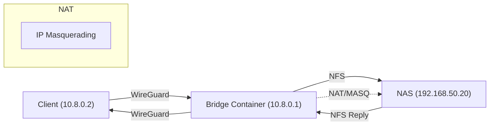
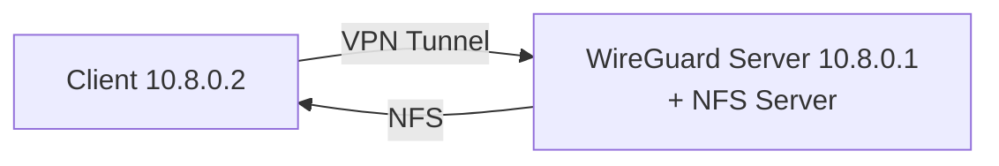
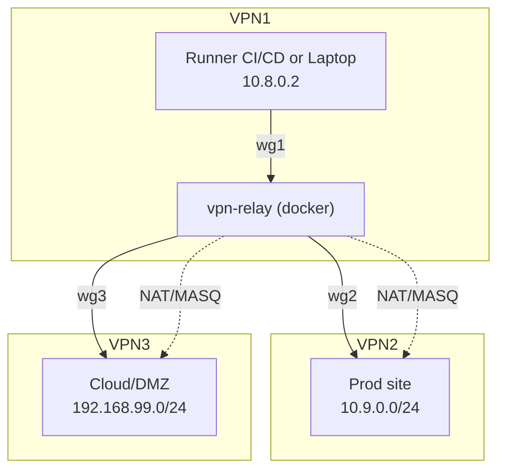
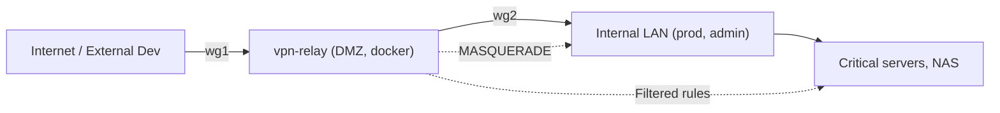
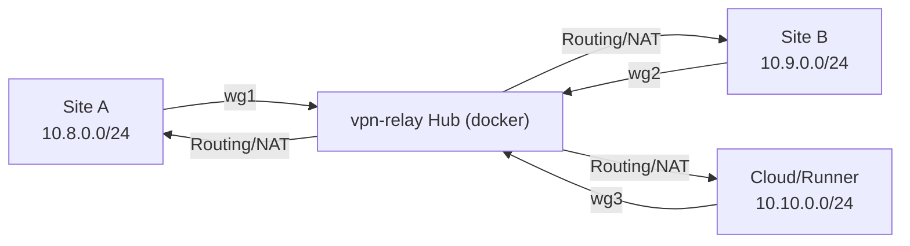
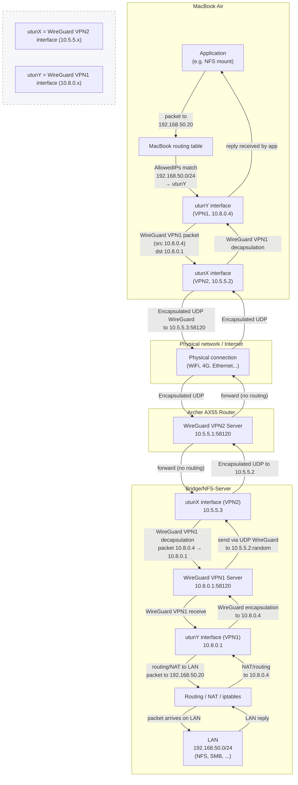

 [](https://hub.docker.com/r/dbndev/nfs-wireguard-bridge)

# NFS WireGuard Bridge


**Secure, high-performance NFS sharing via WireGuard VPN**

This project provides a simple and robust solution for securely exposing local development volumes (or any directory) over NFS, tunneled through a WireGuard VPN. Designed for remote development, hybrid local/cloud workflows, and situations where you want to access private files on a remote LAN (e.g. home, office, datacenter) as if they were local.

---

## Features

- **NFS v3 or v4 server** running inside a dedicated container
- **WireGuard VPN** endpoint (server or client mode)
- Securely bridge any local path, NAS share, or Docker volume over VPN
- 🔑 Only trusted peers (with private key) can access NFS export
- 🚀 High-speed, low-latency transfers (native NFS protocol, direct kernel path)
- **No ports exposed** to WAN/Internet
- 🛡️ Docker Compose/Swarm compatible
- Lightweight, stateless, cloud/devbox/lab-ready

---

## Use Cases

- Access your home/office dev folders from anywhere (laptop, cloud VM, etc)
- Bridge a Synology/TrueNAS or any NAS/NFS appliance behind restrictive firewalls
- Replace SMB or slow SSHFS mounts with real, native NFS
- Connect VSCode devcontainers to your remote workstation or NAS
- Use as a building block for advanced self-hosted CI/CD runners
- Temporary secure access to a build or cache folder for remote jobs

---

## Quickstart

### 1. Run the NFS+WireGuard bridge container on the server side

```yaml
# docker-compose.yml
services:
  server:
    image: dbndev/nfs-wireguard-bridge:latest
    container_name: nfs-wireguard-bridge
    cap_add:
      - NET_ADMIN
    privileged: true
    network_mode: bridge
    ports:
      - "51820:51820/udp"
    volumes:
      - /workspaces:/exports/workspaces:rw
      - /runner:/exports/runner:rw
      # Optionally, bridge a NAS/NFS mount from the host
      - video-nas:/exports/video:rw
    environment:
      - WG_CLIENT_PUBKEY=your_client_pubkey
      - WG_CLIENT_IP=10.8.0.2
      - WG_SERVER_PORT=51820
      # ...more options

volumes:
  video-nas:
    driver: local
    driver_opts:
      type: "nfs"
      o: "addr=nas.local,rw,nfsvers=4"
      device: ":/volume1/video"
```

### 2. Configure your WireGuard client (macOS/Linux/Win/Android)

Obtain the config from `state/client.conf` or generate your own. Example:

```ini
[Interface]
PrivateKey = ...
Address = 10.8.0.2/24
DNS = 1.1.1.1

[Peer]
PublicKey = ...
Endpoint = my-home.example.com:51820
AllowedIPs = 0.0.0.0/0
PersistentKeepalive = 25
```

### 3. Mount NFS from the remote client

```sh
# macOS (example, adjust path as needed)
sudo mount -t nfs -o vers=3,rw,resvport 10.8.0.1:/exports/workspaces /private/tmp/testnfs

# Linux
docker run --rm --cap-add SYS_ADMIN --device /dev/fuse nfs-utils mount -t nfs ...
```

---

## Architecture

### Classic NFS Bridging (with remote NAS)



### Embedded NFS Mode (exporting local volumes directly)


---

## Mode Comparison

| Mode                  | Pros                                                       | Cons                                                     |
|-----------------------|------------------------------------------------------------|----------------------------------------------------------|
| **NFS bridge (NAS)**  | - Directly shares remote NAS                              | - Added routing/iptables complexity                      |
|                       | - No NFS server in container needed (just relay)           | - Adds NAT layer, can impact performance                 |
|                       | - Works with legacy/existing NAS configs                  | - NFS export must allow relay server’s LAN IP            |
| **Embedded NFS**      | - Direct NFS from host paths/volumes (no relay)           | - Shares only container’s accessible folders             |
|                       | - No extra NAT, simple routing                           | - Cannot re-export upstream NFS in all cases (root_squash/NAS options may block) |
|                       | - Fastest for code/CI dev                                 | - Requires host volume mounts                            |

#### When to use each mode?
- Use **Embedded NFS** when you want to share your devbox/server’s real files or Docker bind-mounts directly (full control, best perf, ideal for CI/dev).
- Use **Bridge/NAS** mode when your data is on a NAS or an NFS server you *cannot* touch, or want to provide access to NAS data over VPN.

---

## DockerHub Integration

Build & push automated:

```sh
# Manual push
DOCKER_BUILDKIT=1 docker buildx build --platform linux/amd64,linux/arm64 \
  -t dbndev/nfs-wireguard-bridge:latest --push .
```

- See https://hub.docker.com/r/dbndev/nfs-wireguard-bridge
- Add badge: 
- For CI/CD: add GitHub Actions workflows for multiarch builds and auto-push

---

## Security and Best Practices

- Only allow trusted WireGuard keys/IPs in exports
- Avoid exposing NFS or WireGuard ports on WAN (use firewall, port knock, or reverse proxy for endpoint if needed)
- NFS over WireGuard is secure but NFS itself is not encrypted: **trust your peers**
- Use all_squash/anonuid for read-only shares or multi-user
- Always keep private keys secret; never commit them

---

## Troubleshooting

- If `mount_nfs: ... failed with 2` (No such file or directory): check that the export path exists **in the container**
- If `Permission denied`: check `/etc/exports` IP/CIDR matches the client’s VPN address
- To fix lock errors with NFSv3: run `rpc.statd --no-notify --port 32765 --outgoing-port 32766` and ensure ports are open
- On macOS, always use `resvport` for NFS v3
- See `docker logs nfs-wireguard-bridge` for container-side debug

---

## Credits

- David Berichon (@dbndev)
- ChatGPT & Oboe agent
- Based on Open Source: Debian Linux, WireGuard, nfs-utils

---

## License

MIT

[](https://hub.docker.com/r/dbndev/nfs-wireguard-bridge)

# NFS WireGuard Bridge


**Secure, high-performance NFS sharing via WireGuard VPN**

This project provides a simple and robust solution for securely exposing local development volumes (or any directory) over NFS, tunneled through a WireGuard VPN. Designed for remote development, hybrid local/cloud workflows, and situations where you want to access private files on a remote LAN (e.g. home, office, datacenter) as if they were local.

---

## Features

- **NFS v3 or v4 server** running inside a dedicated container
- **WireGuard VPN** endpoint (server or client mode)
- Securely bridge any local path, NAS share, or Docker volume over VPN
- 🔑 Only trusted peers (with private key) can access NFS export
- 🚀 High-speed, low-latency transfers (native NFS protocol, direct kernel path)
- **No ports exposed** to WAN/Internet
- 🛡️ Docker Compose/Swarm compatible
- Lightweight, stateless, cloud/devbox/lab-ready

---

## Use Cases

- Access your home/office dev folders from anywhere (laptop, cloud VM, etc)
- Bridge a Synology/TrueNAS or any NAS/NFS appliance behind restrictive firewalls
- Replace SMB or slow SSHFS mounts with real, native NFS
- Connect VSCode devcontainers to your remote workstation or NAS
- Use as a building block for advanced self-hosted CI/CD runners
- Temporary secure access to a build or cache folder for remote jobs

---

## Quickstart

### 1. Run the NFS+WireGuard bridge container on the server side

```yaml
# docker-compose.yml
services:
  server:
    image: dbndev/nfs-wireguard-bridge:latest
    container_name: nfs-wireguard-bridge
    cap_add:
      - NET_ADMIN
    privileged: true
    network_mode: bridge
    ports:
      - "51820:51820/udp"
    volumes:
      - /workspaces:/exports/workspaces:rw
      - /runner:/exports/runner:rw
      # Optionally, bridge a NAS/NFS mount from the host
      - video-nas:/exports/video:rw
    environment:
      - WG_CLIENT_PUBKEY=your_client_pubkey
      - WG_CLIENT_IP=10.8.0.2
      - WG_SERVER_PORT=51820
      # ...more options

volumes:
  video-nas:
    driver: local
    driver_opts:
      type: "nfs"
      o: "addr=nas.local,rw,nfsvers=4"
      device: ":/volume1/video"
```

### 2. Configure your WireGuard client (macOS/Linux/Win/Android)

Obtain the config from `state/client.conf` or generate your own. Example:

```ini
[Interface]
PrivateKey = ...
Address = 10.8.0.2/24
DNS = 1.1.1.1

[Peer]
PublicKey = ...
Endpoint = my-home.example.com:51820
AllowedIPs = 0.0.0.0/0
PersistentKeepalive = 25
```

### 3. Mount NFS from the remote client

```sh
# macOS (example, adjust path as needed)
sudo mount -t nfs -o vers=3,rw,resvport 10.8.0.1:/exports/workspaces /private/tmp/testnfs

# Linux
docker run --rm --cap-add SYS_ADMIN --device /dev/fuse nfs-utils mount -t nfs ...
```

---

## Architecture

### Classic NFS Bridging (with remote NAS)


### Embedded NFS Mode (exporting local volumes directly)


---

## Mode Comparison

| Mode                  | Pros                                                       | Cons                                                     |
|-----------------------|------------------------------------------------------------|----------------------------------------------------------|
| **NFS bridge (NAS)**  | - Directly shares remote NAS                              | - Added routing/iptables complexity                      |
|                       | - No NFS server in container needed (just relay)           | - Adds NAT layer, can impact performance                 |
|                       | - Works with legacy/existing NAS configs                  | - NFS export must allow relay server’s LAN IP            |
| **Embedded NFS**      | - Direct NFS from host paths/volumes (no relay)           | - Shares only container’s accessible folders             |
|                       | - No extra NAT, simple routing                           | - Cannot re-export upstream NFS in all cases (root_squash/NAS options may block) |
|                       | - Fastest for code/CI dev                                 | - Requires host volume mounts                            |

#### When to use each mode?
- Use **Embedded NFS** when you want to share your devbox/server’s real files or Docker bind-mounts directly (full control, best perf, ideal for CI/dev).
- Use **Bridge/NAS** mode when your data is on a NAS or an NFS server you *cannot* touch, or want to provide access to NAS data over VPN.

---

## DockerHub Integration

Build & push automated:

```sh
# Manual push
DOCKER_BUILDKIT=1 docker buildx build --platform linux/amd64,linux/arm64 \
  -t dbndev/nfs-wireguard-bridge:latest --push .
```

- See https://hub.docker.com/r/dbndev/nfs-wireguard-bridge
- Add badge: 
- For CI/CD: add GitHub Actions workflows for multiarch builds and auto-push

---

## Security and Best Practices

- Only allow trusted WireGuard keys/IPs in exports
- Avoid exposing NFS or WireGuard ports on WAN (use firewall, port knock, or reverse proxy for endpoint if needed)
- NFS over WireGuard is secure but NFS itself is not encrypted: **trust your peers**
- Use all_squash/anonuid for read-only shares or multi-user
- Always keep private keys secret; never commit them

---

## Troubleshooting

- If `mount_nfs: ... failed with 2` (No such file or directory): check that the export path exists **in the container**
- If `Permission denied`: check `/etc/exports` IP/CIDR matches the client’s VPN address
- To fix lock errors with NFSv3: run `rpc.statd --no-notify --port 32765 --outgoing-port 32766` and ensure ports are open
- On macOS, always use `resvport` for NFS v3
- See `docker logs nfs-wireguard-bridge` for container-side debug

---

## Credits

- David Berichon (@dbndev)
- ChatGPT & Oboe agent
- Based on Open Source: Debian Linux, WireGuard, nfs-utils

---

## License

MIT
[](https://hub.docker.com/r/dbndev/nfs-wireguard-bridge)

# 🚦 NFS WireGuard Bridge

**Secure NFS server behind WireGuard to expose your local folders remotely, with no compromise on security or performance.**  
Share your development environments, projects, Docker volumes, or sensitive data between multiple machines—even across the Internet or NAT.

---

## Table of Contents

- [🚀 Features](#-features)
- [⚡️ Quick Start](#️-quick-start)
- [🛠️ Use Cases](#️-use-cases)
- [🔧 Customization](#-customization)
- [📝 Dependencies](#-dependencies)
- [🏆 WireGuard Benefits](#-wireguard-benefits)
- [❤️ Thanks / Contribution](#-thanks--contribution)
- [🔗 License](#-license)

---

## 🚀 Features

- **NFSv3** served behind **WireGuard** VPN (no need to open ports on the Internet)  
- Native, high-performance NFS mounts (read/write)  
- **Secure remote access** (WireGuard encryption, configurable UDP port)  
- Ready for macOS, Linux, devcontainers, Docker, etc.  
- Usable as a "bridge", "bastion", or microservice in Compose/Swarm/K8s  
- 🔒 All NFS RPC ports are fixed (for VPN/NAT/Cloud compatibility)  

### Example Usage: Accessing a Remote NAS


---

### 📡 Architecture Diagram

```
┌──────────────┐         WireGuard (VPN)         ┌──────────────┐
│  Laptop Mac  │  <───────────────────────────>  │  NFS Server  │
│ (Client WG)  │        UDP/51820 + NFS          │ (Docker Host)│
└──────────────┘                                 └──────────────┘
```

---

## 🧭 Two Modes: Embedded NFS vs. NFS Bridge to NAS

This project offers two main ways to expose your folders via NFS secured by WireGuard:

### Mode 1: Embedded NFS

In this mode, the NFS server runs directly inside the WireGuard container, exposing local host folders.

- **Advantages**  
  - Simple deployment: everything in one container  
  - Ideal for sharing local host folders  
  - Centralized config in the WireGuard container  

- **Limitations**  
  - Performance can be limited depending on container load  
  - Less suitable if you already have a dedicated NAS or NFS server  



### Mode 2: NFS Bridge to NAS

Here, the WireGuard container acts as a VPN bridge to an existing NAS or NFS server on the LAN.

- **Advantages**  
  - Access a remote NAS without exposing its ports to the Internet  
  - Native NAS performance, no extra load on the WireGuard container  
  - Flexible integration with existing infrastructure  

- **Limitations**  
  - Requires an existing NAS or NFS server on the local network  
  - Network/routing setup is a bit more complex  


---

## ⚡️ Quick Start

### 1. Build & Run

```bash
git clone https://github.com/dbndev/nfs-wireguard-bridge.git
cd nfs-wireguard-bridge
make build
make server-up
```

- The host folders `/workspaces` and `/runner` will be exposed via NFS behind the WireGuard VPN.  
- The WireGuard client config is auto-generated in `./state/macbook.conf`.  

---

### 2. Configure Your WireGuard Client (Macbook, PC, Other Server)

- Retrieve the generated config:

```bash
docker cp nfs-wireguard-bridge:/state/macbook.conf ./macbook.conf
```

- Import this file into WireGuard on your client machine.

---

### 3. Mount the NFS Folder

On Mac/Linux, run:

```bash
sudo mount -t nfs -o vers=3,rw,resvport 10.8.0.1:/workspaces /tmp/testnfs
```

- To mount `/runner`, replace `/workspaces` with `/runner`.  
- macOS tip: port 2049 must be accessible; `nolock` is not required here (lockd/statd supported).

---

### 4. Example docker-compose.yml

```yaml
volumes:
  video:
    driver: local
    driver_opts:
      type: "nfs"
      o: "addr=10.8.0.1,rw,vers=3,rsize=8192,wsize=8192,tcp,timeo=14"
      device: ":/workspaces"
```

---

## 🛠️ Use Cases

- Share a local dev workspace with a remote machine (Macbook, PC, VM, cloud…)  
- Centralize data for a multi-host Docker stack via secure NFS  
- Sync projects, scripts, or media between your machines without third-party services  
- Replace SSHFS or SMB in VPN/NAT/restricted network contexts  

### When to Choose Which Mode?

- **Embedded NFS**: if you want to share your local folders directly and prefer a simple all-in-one solution.  
- **NFS Bridge to NAS**: if you already have a NAS or NFS server on your LAN and want to access it securely via VPN.

---

## 🔧 Customization

- The environment variables `NFS_WIREGUARD_SERVER_HOST` and `NFS_WIREGUARD_SERVER_PORT` are available in `docker-compose.yml`.  
- To expose other folders: edit the `volumes:` section in `docker-compose.yml` and add the path to `/etc/exports` via `entrypoint.sh`.  

---

## 📝 Dependencies

- Docker Engine (recommended: version 20+)  
- Client: WireGuard, NFS utility (`nfs-common` on Linux, `nfs-client` on macOS)  

---

## 🏆 WireGuard Benefits

- Instant startup, optimal performance, simple key and route management  
- No “race condition” with port opening (everything is tunneled)  

---

## ❤️ Thanks / Contribution

Feel free to open an issue, submit a PR, or fork!  
This project is used in the Vegito ecosystem, but remains agnostic and open source.

---

## VPN Relay – Multi-site WireGuard Relay for DevOps

**Flexible, multi-tunnel VPN relay designed for secure, automated interconnection of remote networks, DMZ, LAN, cloud, and hybrid environments.**

---

## Why Dockerize a VPN Relay?

### **Concrete Advantages of WireGuard Containerization for DevOps Teams**

- **Extreme portability**: identical deployment on Linux, VM, cloud, cluster, laptop, CI/CD…
- **Reproducibility**: fixed version of WireGuard, scripts, iptables, NAT… all in the image
- **Automation**: orchestratable (compose, swarm, k8s, systemd), “as code” provisioning, GitOps/CI integration
- **Idempotence & maintenance**: restart with no side effects, stateless, easy rolling-update
- **Security**: reduced attack surface, strict permissions (volumes, networks, users, capabilities…)
- **Audit & rollback**: logs, traces, rollbacks on image version
- **Easy migration**: a Dev or Prod stack can be moved between clouds without breaking things
- **Lightweight isolation**: the container controls the kernel interface but does not pollute the host OS
- **Multi-role**: router, relay, bridge, DMZ, mesh, failover, multi-site NAT

### **Why does the DevOps industry already work this way?**
- **Containerized network infra** (DNS, reverse-proxy, VPN, mesh, loadbalancer, firewall, monitoring…) is **the standard** for all “as code” contexts.
- WireGuard, like OpenVPN, StrongSwan, or FRR, is widely used in container form for portability, automation, CI/CD, cloud and hybrid environments.
- DevOps teams deploy and manage their “network backbone” the same way as their app infra, using Docker/K8s/Nomad/Compose/Terraform, etc.

---

## Typical Use Cases (DevOps & Modern IT)

- **VPN relay between multiple sites, datacenters, or clouds**
- **Chained VPN**: mobile → cloud/fiber entry point → enterprise backbone
- **DMZ gateway** to isolate public prod from internal admin
- **CI/CD automation**: ephemeral tunnels for tests, secure access to private resources
- **Failover and redundancy**: multi-site mesh for SRE, disaster recovery resilience
- **LAN ↔ cloud bridge**: secure access to on-prem internal services from the cloud or a CI runner
- **Multi-tenant network**, isolation of prod/staging/dev by subnet

---

## Quick Start

```yaml
services:
  vpn-relay:
    image: dbndev/vpn-relay:latest
    container_name: vpn-relay
    cap_add:
      - NET_ADMIN
    privileged: true
    network_mode: bridge
    ports:
      - "51820:51820/udp"
      - "51820:51820/udp"
    volumes:
      - ./state:/state
      - ./conf:/conf
    environment:
      - WG1_INTERFACE=wg1
      - WG1_PRIVATE_KEY=...
      - WG1_PORT=51820
      - WG1_PEERS=...
      - WG2_INTERFACE=wg2
      - WG2_PRIVATE_KEY=...
      - WG2_PORT=51820
      - WG2_PEERS=...
```

- All WireGuard config files are stored in `/conf` or `/state`
- The container auto-detects and mounts client interfaces (multi-peer)
- NAT/iptables/routing rules can be customized/automated

---

## Architecture – Usage Diagrams

### 🟦 Multi-VPN Relay (DevOps chaining, cloud access)



### 🟩 DMZ Gateway (admin access isolation)



### 🟨 Mesh/Hub for Multi-site Failover



### 🟫 Double-VPN / Multi-homed Bridge (Advanced Scenario)

#### Scenario: Remote NFS mount via nested VPN to bypass router/NAT limitations or mobile/ISP restrictions using a VPN relay.

##### Step-by-step breakdown
1. MacBook prepares a packet to 192.168.50.20 (LAN)
2. Local routing (via AllowedIPs) sends this packet into interface utunY (VPN1), which encapsulates it in WireGuard (source 10.8.0.4 → 10.8.0.1)
3. The VPN1 tunnel, whose endpoint is actually 10.5.5.3:58120 (the bridge's address on VPN2), carries this packet through the VPN2 tunnel (utunX/10.5.5.2)
4. The physical network (WiFi, 4G, Internet) only sees UDP WireGuard packets to 10.5.5.3:58120
5. Archer AX55 receives traffic on its VPN2 interface, simply forwards to 10.5.5.3 (bridge)—it does not route
6. Bridge receives the UDP flow on 10.5.5.3:58120, decapsulates VPN1, processes the traffic on 10.8.0.1 (multi-homed)
7. Bridge routes or NATs the traffic to LAN 192.168.50.x via its local rules (iptables or direct routing)
8. The reply follows the reverse path, encapsulated in VPN1 then VPN2 back to the MacBook



---

## DevOps Best Practices

- **Everything as code/infra as code** (compose, Makefile, Terraform…)
- **Automate keys, peers, NAT, routes** (init scripts, hooks, pipelines)
- **Audit/Logging** via stdout, Docker logs, monitoring sidecar
- **Security**: regular key rotation, strict AllowedIPs, admin exposure control
- **Idempotence**: redeploy safely, rolling-update support, clean teardown
- **Observability**: connectivity tests, traces, state hooks, customizable healthchecks

---

## Supported Environment Variables

- `WG1_INTERFACE`, `WG2_INTERFACE`, …
- `WG1_PRIVATE_KEY`, `WG2_PRIVATE_KEY`, …
- `WG1_PORT`, `WG2_PORT`, …
- `WG1_PEERS`, `WG2_PEERS`, …
- `NAT_RULES` (optional)
- `ROUTE_RULES` (optional)

---

## 📣 Author

David Berichon ([dbndev](https://github.com/dbndev))

---

## 📦 Docker Hub

Contact me if you want a ready-to-use public image!

---

## 🔗 License

MIT